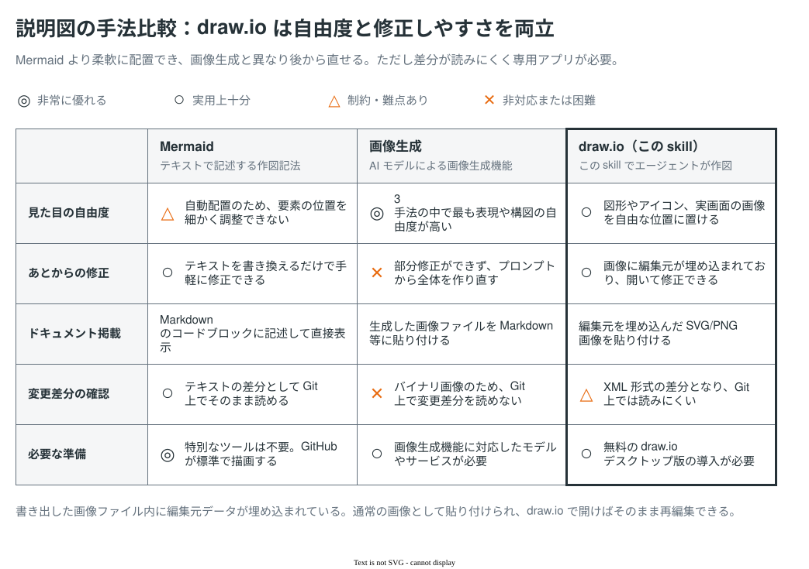
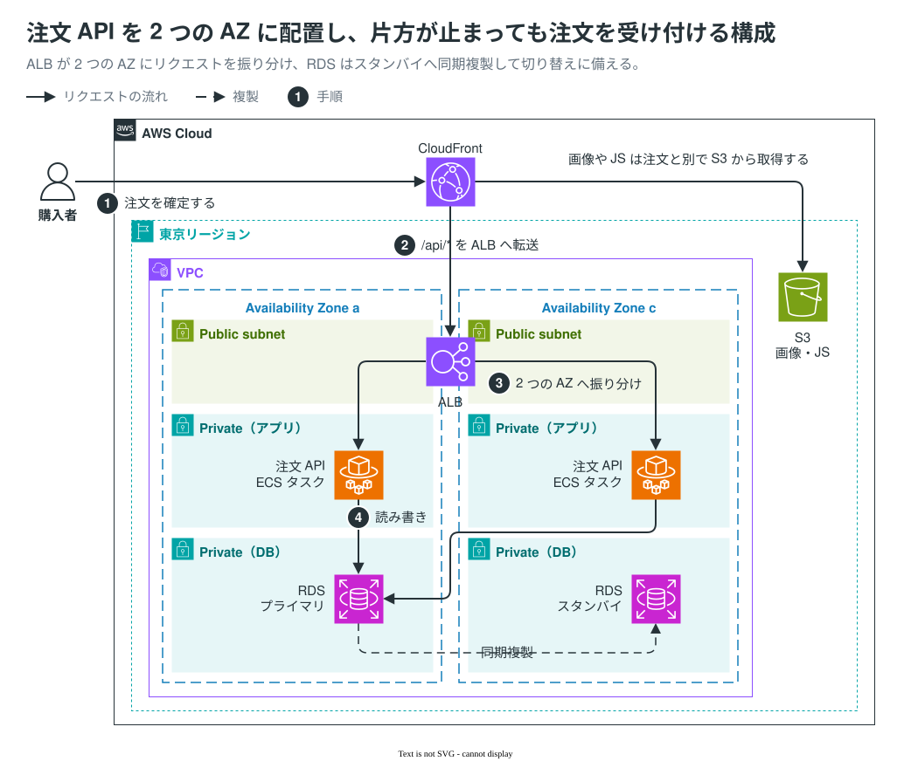
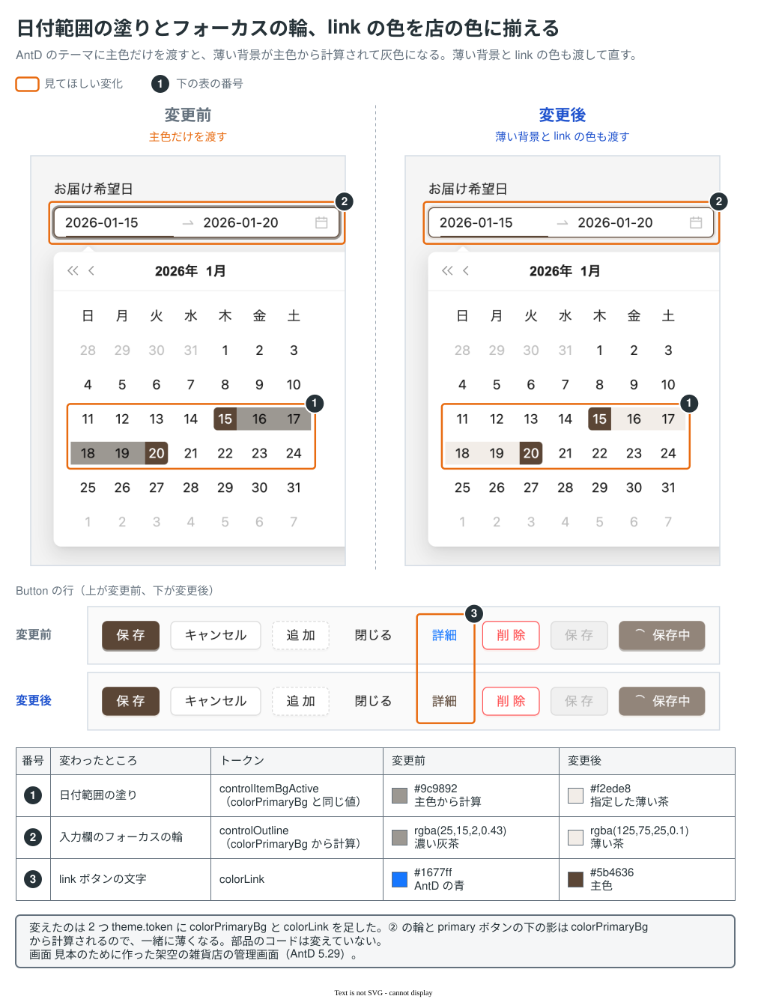

[English](README.md) | [简体中文](README.zh-CN.md) | 日本語

# explanatory-diagrams

差分テキストや設計メモ、画面キャプチャを渡すだけで、draw.io 形式の説明図を生成するスキルです。出力形式には、編集データを内包した SVG（`.drawio.svg`）を採用しています。Markdown には通常の画像としてそのまま貼り付けられ、配置の微調整や文言の変更が必要になったときは、draw.io で開いてそのまま手直しできます。エージェントに頼んで直してもらうこともできます。

## なぜ draw.io なのか

表現の幅、文字と構造の正確さ、あとからの直しやすさを両立させるための選択です。



Mermaid などのテキスト記述は手軽ですが、決まった種類の図を自動で配置するため、描ける構図に制約があります。一方で画像生成 AI の出力は、見た目が整っていても細かい文字や線が指示とずれることがあり、一部だけ直すのも難しくなります。draw.io であれば、図形・アイコン・画面の画像を好きな位置に置けて、あとから一部だけ直せます。代わりに、差分は draw.io の XML になって読みにくく、draw.io のデスクトップ版が必要です。

## 作図例

18 種類のテンプレートから目的に近いものを選び、その構図に沿って作図します。合うものがなければ、新しい構図で描きます。

- **[テンプレート一覧（全 18 種）](skills/explanatory-diagrams/templates/README.md)**：インフラ構成図、シーケンス図、状態遷移図、ER 図、UI 変更の比較図など

### インフラ構成図

2 つのアベイラビリティゾーン（AZ）にまたがる注文 API の冗長構成です。リクエストの流れに番号を振って順に追えるようにし、RDS からスタンバイへの同期複製も示しています。



### UI の変更比較

テーマカラー変更前後の画面比較です。変更箇所を枠線で囲み、枠番号と下部の対比表を紐付けることで、どのスタイル値がどう変わったかをひと目で確認できます。



※ 上記の見本は人間が調整した基準データです。自動生成による実際の出力は [モデル別の検証結果](tests/skill-evals/explanatory-diagrams/README.md) を参照してください。

## 必要な環境

以下のツールを利用します。

- **draw.io（デスクトップ版）**：図を SVG へ書き出す際に使用（macOS の標準アプリケーションパスを想定）。
- **Python 3**：キャプチャ画像を SVG 内に埋め込む前処理に使用。
- **GitHub CLI（`gh`）**：生成した図を Pull Request に添付する際に使用。

サンドボックス環境で動かす場合は、[サンドボックスの設定手順](docs/sandbox.ja.md) を確認してください。

## インストール

利用環境に合わせて、以下のいずれか 1 つの方法で導入します。

### 1. skills CLI（推奨）

```sh
npx skills@latest add nntto/explanatory-diagrams --skill explanatory-diagrams -g -a claude-code -a codex
```

現在のプロジェクトにのみ適用する場合は `-g` を外します。

### 2. Claude Code プラグイン

```sh
claude plugin marketplace add nntto/explanatory-diagrams
claude plugin install explanatory-diagrams@nntto
```

※ Claude Code 2.1.142 以降が必要です。

### 3. 手動配置

リポジトリを取得し、スキルの配置先へシンボリックリンクを作成します。

```sh
git clone https://github.com/nntto/explanatory-diagrams.git
mkdir -p ~/.claude/skills ~/.agents/skills
ln -s "$PWD/explanatory-diagrams/skills/explanatory-diagrams" ~/.claude/skills/explanatory-diagrams
ln -s "$PWD/explanatory-diagrams/skills/explanatory-diagrams" ~/.agents/skills/explanatory-diagrams
```

## 使い方

作図のもとになる資料（差分、メモ、画像）を指定し、ふだんの言葉で指示を出します。

- 「この PR の変更内容を説明する図を作って。main ブランチとの差分を見て。」
- 「infra.diff をもとに、インフラ構成の変更図を描いて。」
- 「変更前後のスクリーンショットをもとに、UI カラーの変更箇所を比べる図を作って。」

明示的にスキルを指定して呼び出す構文も利用できます。

- Claude Code：`/explanatory-diagrams`（プラグイン導入時は `/explanatory-diagrams:explanatory-diagrams`）
- Codex：`$explanatory-diagrams`

図の中のテキストは、図を載せる文書の言語に合わせて出力されます。

## モデル別の出力結果

7 つのモデル（Claude 系 4 種、Codex 系 3 種）に同一の指示と資料を渡したときの出力を、[評価ディレクトリ](tests/skill-evals/explanatory-diagrams/README.md) にまとめています。

## ライセンス

[MIT License](LICENSE) のもとで公開しています。ただし、見本テンプレートおよび評価結果に含まれる AWS アイコンは本ライセンスの対象外であり、[AWS アイコンの利用規約](https://aws.amazon.com/architecture/icons/) に従います。
