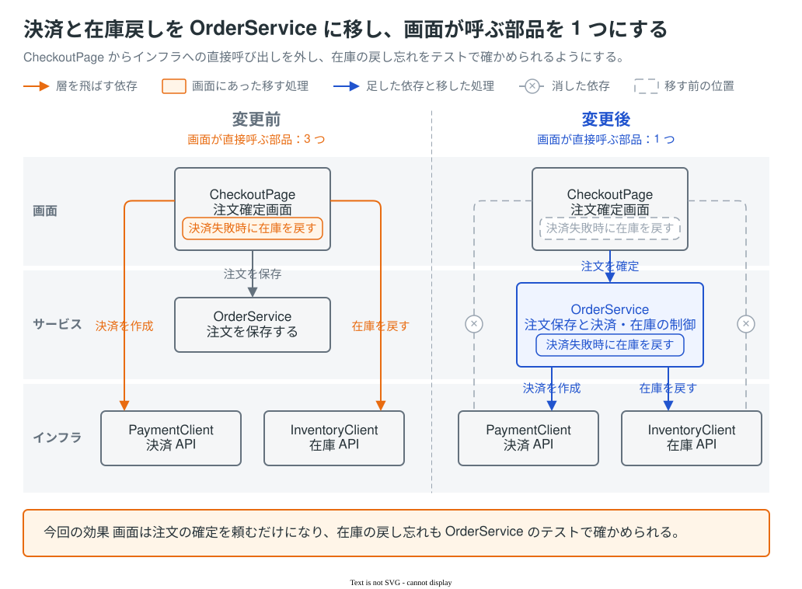

[English](README.md) | [简体中文](README.zh-CN.md) | 日本語

# explanatory-diagrams

PR 本文や設計ドキュメントに載せる説明図を、エージェントに draw.io で描かせる skill。依頼と資料（差分、メモ、画面の画像など）から図を描き、編集元を埋め込んだ SVG（`.drawio.svg`）を返す。画像としてそのまま貼れ、draw.io で開けば直せる。



人が仕上げた見本。この skill に依頼して実際に返ってきた図は、[モデルごとの出力](#モデルごとの出力)にある。

## なぜ draw.io か


draw.io は Mermaid より自由に配置でき、画像生成と違って後から直せる。ただし差分は draw.io の XML で読みにくく、draw.io のデスクトップ版が要る。

## 得意なもの・しないこと

得意なもの:

- 変更前後の比較
- システム構成・AWS 構成図
- データモデル（ER 図）
- 状態の置き場
- シーケンス図
- 状態遷移図
- 業務フロー
- 集合と要素
- コードと実行時の値
- 画面のデザインの変化
- 色のパレット

しないこと: 画像生成と画面の撮影。それを扱うほかの道具に任せる。

## 入れ方

Claude Code と Codex で使える。同じエージェントには 1 つの方法で入れ、複数の方法を重ねない。以下は各ツールの資料に沿って書いた手順で、まだ通しで試していない。

### A. skills CLI（主な方法）

```sh
npx skills@latest add nntto/explanatory-diagrams --skill explanatory-diagrams -g -a claude-code -a codex
```

`-g` を付けると個人用に入る。Codex は `~/.agents/skills/`、Claude Code は `~/.claude/skills/` に入る。今のプロジェクトだけに入れるなら `-g` を外す。

### B. Claude Code のプラグインのマーケットプレイス

```sh
claude plugin marketplace add nntto/explanatory-diagrams
claude plugin install explanatory-diagrams@nntto
```

このプラグインは、プラグインのルートに `SKILL.md` を置いている。Claude Code の変更履歴では、この形は 2.1.142 以降で読める。呼び出すときは `/explanatory-diagrams:explanatory-diagrams`。

### C. 手で置く

```sh
git clone https://github.com/nntto/explanatory-diagrams.git
mkdir -p ~/.claude/skills ~/.agents/skills
ln -s "$PWD/explanatory-diagrams/skills/explanatory-diagrams" ~/.claude/skills/explanatory-diagrams
ln -s "$PWD/explanatory-diagrams/skills/explanatory-diagrams" ~/.agents/skills/explanatory-diagrams
```

## 前提

- draw.io デスクトップ版。skill の手順のコマンドは macOS のパス（`/Applications/draw.io.app/Contents/MacOS/draw.io`）で書いている。確かめたのは macOS 26.6、draw.io 31.4.4。ほかの OS では試していない。
- `python3`。画面の画像を図に埋め込むときに使う。
- `gh`。図を PR に貼るときに使う。`gh pr edit --attach` が SVG を受け付けるかは未確認。

### サンドボックス

OS のサンドボックスの中では、draw.io の書き出しが異常終了する。エージェントをサンドボックスで動かしているなら、draw.io のコマンドだけをサンドボックスの外で動かすよう、使う人が設定する。

- Claude Code: settings の `sandbox.excludedCommands` にコマンドを足す。

  ```json
  {
    "sandbox": {
      "excludedCommands": ["/Applications/draw.io.app/Contents/MacOS/draw.io:*"]
    }
  }
  ```

- Codex: `~/.codex/rules/` の下の `.rules` ファイル（例: `~/.codex/rules/drawio.rules`）に次のルールを足す。

  ```python
  prefix_rule(pattern=["/Applications/draw.io.app/Contents/MacOS/draw.io", "-x"], decision="allow")
  ```

どちらも、draw.io のコマンドがサンドボックスの外で動くのは、単独で実行したときだけ。`&&`、`;`、パイプなどでほかのコマンドとつなぐと、サンドボックスの中で動き、書き出しが異常終了する。

## 使い方

ふつうの言葉で頼む。たとえば:

- 「この PR の変更を、PR 本文に載せる図にして。main との差分を見て。」
- 「infra.diff をもとに、構成の変更を図にして。」
- 「変更前後の画面の画像から、色の変更を比べる図を作って。」

はっきり呼び出すときは、Claude Code では `/explanatory-diagrams`（プラグインで入れたときは `/explanatory-diagrams:explanatory-diagrams`）、Codex では `$explanatory-diagrams` を使う。

図の文言は、図を載せる先の文書の言語で書く。英語で頼んでも、日本語の PR に載せる図なら文言は日本語になる。

## 見本の一覧

一覧と使う場面は [templates/README.md](skills/explanatory-diagrams/templates/README.md) にある。見本は 18 枚で、見せ方・リファクタリングの説明・図の種類の 3 つに分かれている。

見本には英語・中国語（簡体字）・日本語の版がある。版の違いは文言だけで、design-before-after に埋め込んだ画面の画像はどの版でも日本語のまま。skill が配るのは日本語の版だけ。英語版と中国語版は README で読むためのもので、このリポジトリの `docs/samples/` に置いている。図の文言は図を載せる先の文書の言語で書く（[使い方](#使い方)）ので、ほかの言語の文書に図を描くときは、エージェントが見本の文言を訳して描く。

## モデルごとの出力

同じ依頼と資料を渡したとき、モデルごとに何が返ったかを[このページ](tests/skill-evals/explanatory-diagrams/README.md)に並べている。

2026-09-26 に、Claude Code 2.1.282 で Claude の 4 モデル（Opus 5.5、Sonnet 5、Haiku 4.5、Fable 5.1）を、codex-cli 0.156.0 で Codex の 3 モデル（gpt-6-astra、gpt-6-sol、gpt-6-luna）を、1 回ずつ実行した。使ったのはこのリポジトリに移す前の skill で、そのときの書き出しは PNG（`.drawio.png`）だった。Haiku 4.5 を除く 6 モデルは、3 ケースとも編集元を埋め込んだ `.drawio.png` を返した。Haiku 4.5 は、3 ケースとも編集元のない PNG を返した。確かめたのは形式を守ったかどうかで、図の良し悪しではない。1 回ずつなので、違いが傾向かぶれかは分からない。ページは、モデルの返答も含めて日本語。

| ケース | 説明する変更 | 渡した資料 |
|---|---|---|
| [aws-infra-change](tests/skill-evals/explanatory-diagrams/README.md#aws-infra-change) | 商品画像の置き場を EFS から S3 に移し、CloudFront から配信する | 変更のメモと、Terraform の差分・変更後の一式 |
| [design-token-change](tests/skill-evals/explanatory-diagrams/README.md#design-token-change) | 状態の色（成功・警告・エラー）を店の色に合わせる | 変更のメモと、変更前後の画面の画像 4 枚 |
| [refactor-dependency-inversion](tests/skill-evals/explanatory-diagrams/README.md#refactor-dependency-inversion) | 出荷の処理が SDK を直接呼ばないよう、依存の向きを逆にする | git リポジトリ（main と作業ブランチ）と、変更のメモ |

## ライセンス

MIT（[LICENSE](LICENSE)）。

- AWS のアイコン（見本の aws-architecture と before-after-diff、eval の出力の一部）は対象外。[AWS の規約](https://aws.amazon.com/architecture/icons/)に従う。
- 見本と eval の題材（雑貨店の EC と管理画面）、人名・住所・電話番号・注文番号、数値、業務のルール（返金の自動承認の金額、送料など）は、すべて見本と eval のために作った架空のもの。
- skill の引用の手順（[references/drawio-workflow.md](skills/explanatory-diagrams/references/drawio-workflow.md#既存図の再利用)）は、日本の著作権法の引用の考え方に沿っている。

## 問い合わせ

質問や不具合は Issue で受け付ける。
