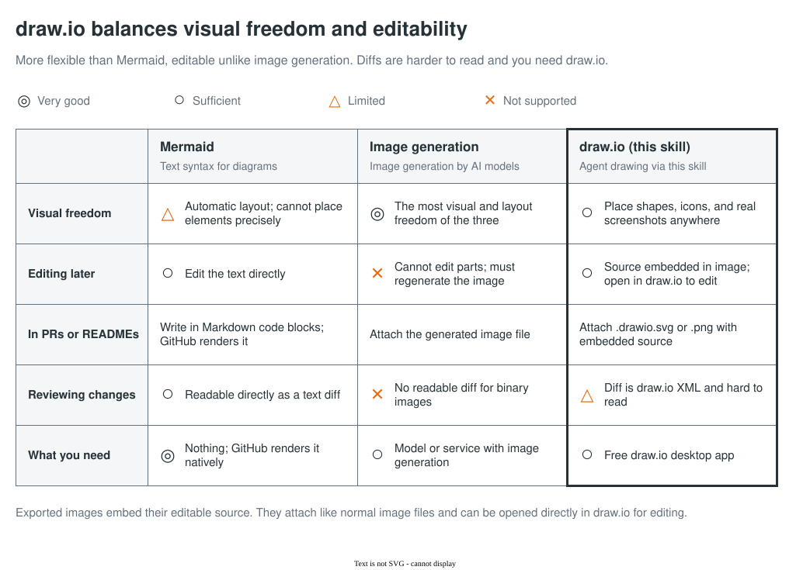
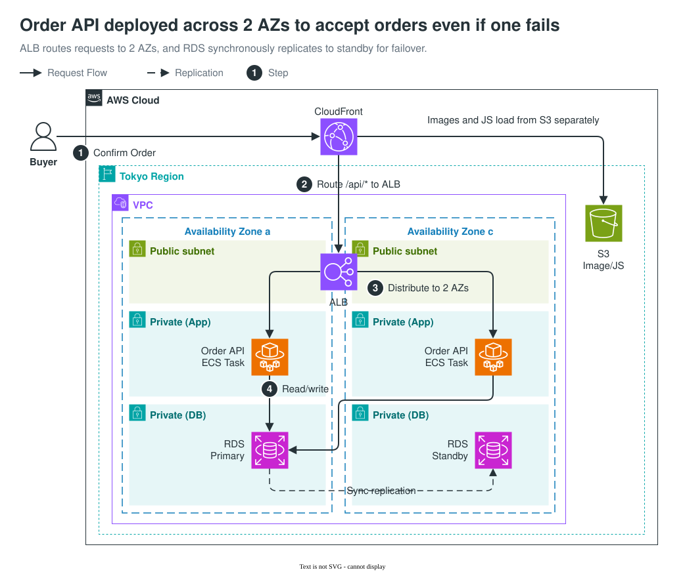
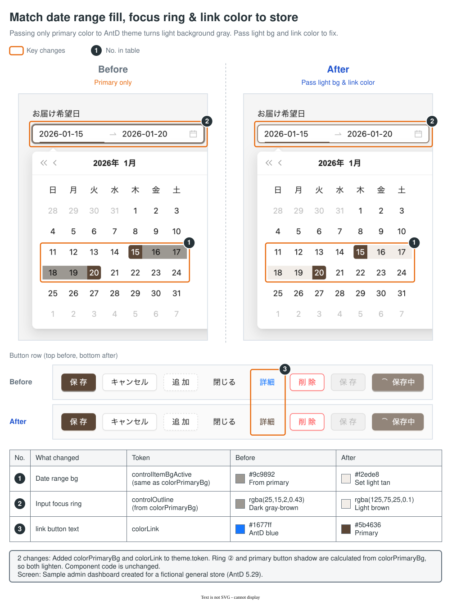

English | [简体中文](README.zh-CN.md) | [日本語](README.ja.md)

# explanatory-diagrams

A skill that generates draw.io explanatory diagrams directly from diffs, notes, or screenshots. It outputs SVGs with embedded draw.io editable data (`.drawio.svg`). You can embed the generated files directly into Markdown as standard images, and open them in draw.io whenever you need to adjust layouts or update labels. You can also ask the agent to make the changes for you.

## Why draw.io?

To balance range of expression, accurate text and structure, and easy edits later.



Text-based tools like Mermaid are lightweight, but they lay out a fixed set of diagram types automatically, which limits what you can draw. Image generation models produce polished graphics, but small text and lines can drift from the instructions, and fixing just one part is hard. With draw.io, shapes, icons, and screenshots can go anywhere on the canvas, and you can fix just one part later. In exchange, diffs are draw.io XML and hard to read, and you need the draw.io desktop app.

## Examples

The skill picks the closest of 18 built-in templates and follows its layout. If none fits, it draws a new layout.

- **[Template List (18 templates)](docs/samples/en/README.md)**: Architecture diagrams, sequence diagrams, state machines, ER diagrams, before/after UI comparisons, and more.

### AWS Architecture

A high-availability order API deployed across two Availability Zones (AZs). Numbered arrows trace the request flow, and the diagram also shows synchronous replication from RDS to its standby.



### UI Before & After

A comparison of interface styles before and after a theme color update. Modified components are outlined with numbered boxes corresponding to the table below, allowing quick verification of style token changes.



*Note: The samples above were curated by human editors. To see raw outputs generated by different models, check the [Evaluation Results](tests/skill-evals/explanatory-diagrams/README.md).*

## Prerequisites

- **draw.io Desktop**: Used to export diagrams to SVG (expects standard macOS application path).
- **Python 3**: Used to embed screenshot images into the SVG payload.

If running inside an OS sandbox, refer to [Sandbox Configuration](docs/sandbox.md).

## Installation

Choose one of the following methods:

### 1. skills CLI (Recommended)

```sh
npx skills@latest add nntto/explanatory-diagrams --skill explanatory-diagrams -g -a claude-code -a codex
```

Omit `-g` to install only for the current project.

### 2. Claude Code Plugin

```sh
claude plugin marketplace add nntto/explanatory-diagrams
claude plugin install explanatory-diagrams@nntto
```

Requires Claude Code 2.1.142 or later.

### 3. Manual

Clone the repository and symlink the skill directory:

```sh
git clone https://github.com/nntto/explanatory-diagrams.git
mkdir -p ~/.claude/skills ~/.agents/skills
ln -s "$PWD/explanatory-diagrams/skills/explanatory-diagrams" ~/.claude/skills/explanatory-diagrams
ln -s "$PWD/explanatory-diagrams/skills/explanatory-diagrams" ~/.agents/skills/explanatory-diagrams
```

## Usage

Provide the source material (diff, notes, or images) and instruct the agent using natural language:

- "Create an explanatory diagram for this PR based on git diff with main."
- "Draw an architecture diagram showing the infrastructure changes in infra.diff."
- "Compare the UI color changes based on these before and after screenshots."

You can also trigger the skill explicitly:

- Claude Code: `/explanatory-diagrams` (or `/explanatory-diagrams:explanatory-diagrams` if installed as a plugin)
- Codex: `$explanatory-diagrams`

Labels within the diagram match the language of the document the diagram goes into.

## Model Outputs

Outputs from 7 different models (4 Claude and 3 Codex variants) tested with identical prompts and inputs are available in the [Evaluation Directory](tests/skill-evals/explanatory-diagrams/README.md).

## License

Released under the [MIT License](LICENSE). AWS icons included in templates and evaluations are subject to the [AWS Architecture Icons Terms](https://aws.amazon.com/architecture/icons/).
