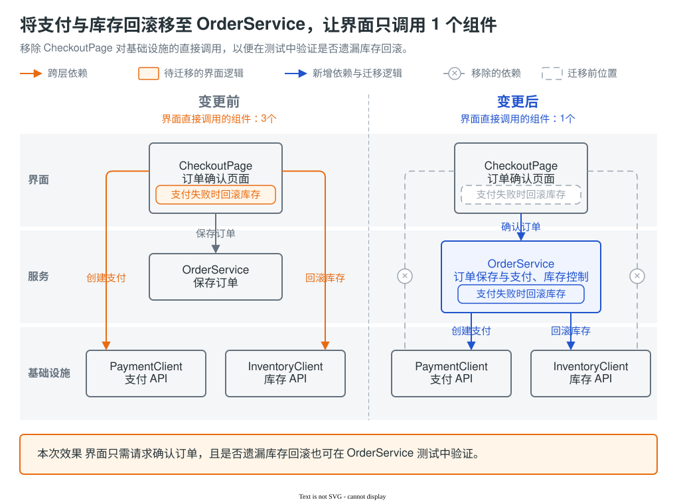
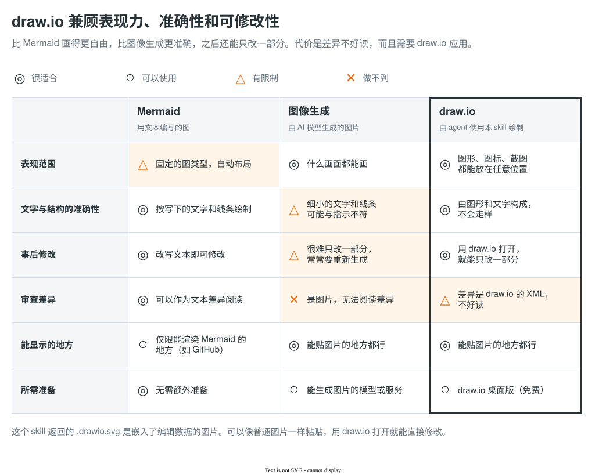

[English](README.md) | 简体中文 | [日本語](README.ja.md)

# explanatory-diagrams

一个 agent skill，让编码 agent 用 draw.io 为 pull request 描述和设计文档画说明图。agent 根据你的请求和资料（如 diff、笔记、截图）画图，返回嵌入了 draw.io 源数据的 SVG（`.drawio.svg`）。它可以像普通图片一样粘贴，也可以用 draw.io 打开并编辑。



这是人工完成的样例。agent 使用这个 skill 实际返回的图，见[各模型的输出](#各模型的输出)。

## 为什么用 draw.io



draw.io 的布局比 Mermaid 更自由，而且和图像生成不同，之后还能修改图。代价是：diff 是 draw.io 的 XML，不好读；另外需要 draw.io 桌面版。

## 适用范围

擅长：

- 变更前后的对比
- 系统架构图和 AWS 架构图
- 数据模型（ER 图）
- 状态放在哪里
- 时序图
- 状态机图
- 业务流程
- 集合与元素
- 代码与运行时的值
- UI 设计的变化
- 色板

不在范围内：图像生成和截图。这些交给能处理它们的其他工具。

## 安装

支持 Claude Code 和 Codex。每个 agent 只用一种方法安装，不要用多种方法重复安装同一个 skill。以下步骤依照各工具的文档编写，还没有从头到尾测试过。

### A. skills CLI（主要方法）

```sh
npx skills@latest add nntto/explanatory-diagrams --skill explanatory-diagrams -g -a claude-code -a codex
```

`-g` 表示为当前用户安装：Codex 装到 `~/.agents/skills/`，Claude Code 装到 `~/.claude/skills/`。只想装在当前项目中时，去掉 `-g`。

### B. Claude Code 插件市场

```sh
claude plugin marketplace add nntto/explanatory-diagrams
claude plugin install explanatory-diagrams@nntto
```

这个插件把 `SKILL.md` 放在插件根目录。根据 Claude Code 的 changelog，Claude Code 2.1.142 及以后的版本能读取这种结构。调用方式为 `/explanatory-diagrams:explanatory-diagrams`。

### C. 手动安装

```sh
git clone https://github.com/nntto/explanatory-diagrams.git
mkdir -p ~/.claude/skills ~/.agents/skills
ln -s "$PWD/explanatory-diagrams/skills/explanatory-diagrams" ~/.claude/skills/explanatory-diagrams
ln -s "$PWD/explanatory-diagrams/skills/explanatory-diagrams" ~/.agents/skills/explanatory-diagrams
```

## 前提条件

- draw.io 桌面版。skill 中的命令使用 macOS 的路径（`/Applications/draw.io.app/Contents/MacOS/draw.io`）。已在 macOS 26.6 和 draw.io 31.4.4 上测试，没有在其他操作系统上试过。
- `python3`，用于把截图嵌入图中。
- `gh`，用于把图放进 pull request。尚未确认 `gh pr edit --attach` 是否接受 SVG。

### 沙箱

在操作系统的沙箱中，draw.io 导出会崩溃。如果你在沙箱中运行 agent，需要自己配置，只让 draw.io 命令在沙箱外运行。

- Claude Code：在 settings 的 `sandbox.excludedCommands` 中加入该命令。

  ```json
  {
    "sandbox": {
      "excludedCommands": ["/Applications/draw.io.app/Contents/MacOS/draw.io:*"]
    }
  }
  ```

- Codex：在 `~/.codex/rules/` 下的 `.rules` 文件（例如 `~/.codex/rules/drawio.rules`）中加入以下规则。

  ```python
  prefix_rule(pattern=["/Applications/draw.io.app/Contents/MacOS/draw.io", "-x"], decision="allow")
  ```

两种情况下，draw.io 命令都只有在单独运行时才会在沙箱外运行。如果和其他命令连在一起（例如用 `&&`、`;` 或管道），它会在沙箱内运行，导出会失败。

## 用法

用平常的话提出请求。例如：

- “把这个 PR 的变更画成图，放进 PR 描述。和 main 比较。”
- “根据 infra.diff，把基础设施的变更画成图。”
- “根据变更前后的截图，做一张对比颜色变化的图。”

要明确调用这个 skill，在 Claude Code 中用 `/explanatory-diagrams`（以插件方式安装时用 `/explanatory-diagrams:explanatory-diagrams`），在 Codex 中用 `$explanatory-diagrams`。

图中的文字使用图所在文档的语言。即使你用英语提出请求，只要图放进日语的 PR，图中文字就是日语。

## 样例

样例列表及各自的使用场景见 [docs/samples/zh-CN/README.md](docs/samples/zh-CN/README.md)。共有 18 个样例，分为三类：变更的展示方式、重构的说明、图的类型。

样例有英语、简体中文和日语三个版本，各版本只有文字不同。design-before-after 中嵌入的界面截图在所有版本中都是日语。skill 只包含日语版。英语版和中文版放在本仓库的 `docs/samples/` 中，供阅读本 README 时查看。图中的文字使用图所在文档的语言（见[用法](#用法)），所以为其他语言的文档画图时，agent 会翻译样例中的文字。

## 各模型的输出

[这个页面](tests/skill-evals/explanatory-diagrams/README.md)列出了在相同请求和资料下各模型返回的结果。

2026-09-26，我们在 Claude Code 2.1.282 上用 4 个 Claude 模型（Opus 5.5、Sonnet 5、Haiku 4.5、Fable 5.1），在 codex-cli 0.156.0 上用 3 个 Codex 模型（gpt-6-astra、gpt-6-sol、gpt-6-luna），把每个案例各运行了一次。运行时用的是迁移到这个仓库之前的 skill，当时导出的是 PNG（`.drawio.png`）。6 个模型在全部 3 个案例中都返回了嵌入源数据的 `.drawio.png`；Haiku 4.5 在全部 3 个案例中都返回了不含源数据的 PNG。我们只检查了输出是否符合格式，没有评价图的好坏。每个案例只运行了一次，无法判断这些差异是趋势还是偶然。这个页面（包括模型的回复）是日语的。

| 案例 | 要说明的变更 | 提供的资料 |
|---|---|---|
| [aws-infra-change](tests/skill-evals/explanatory-diagrams/README.md#aws-infra-change) | 把商品图片从 EFS 移到 S3，并通过 CloudFront 分发 | 变更笔记，以及 Terraform 的 diff 和变更后的完整配置 |
| [design-token-change](tests/skill-evals/explanatory-diagrams/README.md#design-token-change) | 让状态颜色（成功、警告、错误）与店铺的颜色一致 | 变更笔记，以及 4 张变更前后的截图 |
| [refactor-dependency-inversion](tests/skill-evals/explanatory-diagrams/README.md#refactor-dependency-inversion) | 反转依赖方向，让发货逻辑不再直接调用 SDK | 一个 git 仓库（main 和工作分支），以及变更笔记 |

## 许可证

MIT（[LICENSE](LICENSE)）。

- AWS Architecture Icons（出现在 aws-architecture 和 before-after-diff 样例以及部分 eval 输出中）不在此许可证范围内，遵循 [AWS 的条款](https://aws.amazon.com/architecture/icons/)。
- 样例和 eval 的题材（一家杂货网店及其管理后台）、人名、地址、电话号码、订单号、数值以及业务规则（如退款自动批准的金额和运费）都是为样例和 eval 虚构的。
- skill 中引用他人资料的步骤（[references/drawio-workflow.md](skills/explanatory-diagrams/references/drawio-workflow.md#既存図の再利用)）遵循日本著作权法中关于引用的思路。

## 联系方式

有问题或发现 bug，请提交 Issue。
