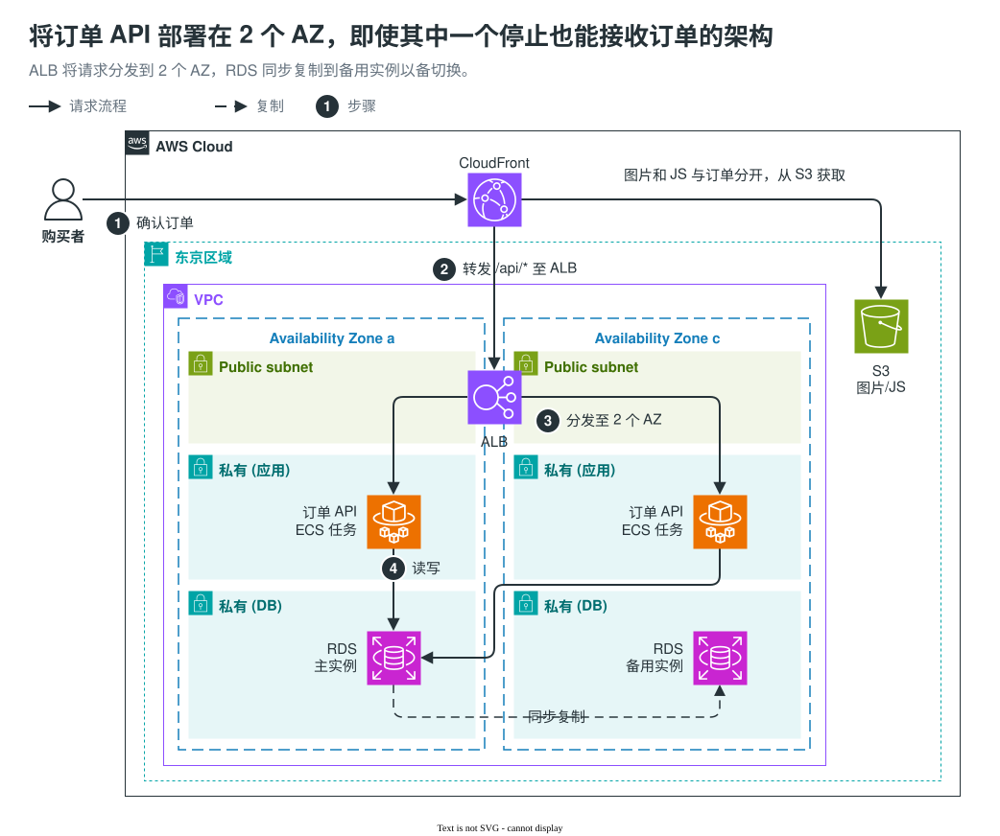

[English](README.md) | 简体中文 | [日本語](README.ja.md)

# explanatory-diagrams

这个 skill 让 Claude Code、Codex 等编程 agent 用 draw.io 绘制放在 PR 描述和设计文档里的图。把 diff、笔记或界面截图交给 agent，它会画好图，并返回嵌入了 draw.io 编辑数据的 SVG（`.drawio.svg`）。这个文件可以像普通图片一样贴进 Markdown，之后用 draw.io 打开就能直接修改。

## 样例

**[查看全部 18 个样例](docs/samples/zh-CN/README.md)**：包括变更前后的对比方式、重构的说明，以及架构图、时序图、状态机图、ER 图等图的类型，每个样例都附有适用场景。agent 会从中挑选最接近的样例，按它的版式来画。

**AWS 架构图**：把订单 API 部署在两个可用区（AZ），即使其中一个停止也能继续接收订单。请求的流程按顺序编了号。



**并排界面对比设计变化**：把修改主题颜色前后的界面截图并排放在一起。变化的部件用橙色框圈出，框上的编号对应下方表格中变化的值。截图中的界面是日语的模拟管理后台。


样例都经过人工修整。agent 使用这个 skill 实际返回的图，见[各模型的输出](#各模型的输出)。

## 为什么用 draw.io


## 安装

同一个 agent 只用下面的一种方法安装。

### A. skills CLI（推荐）

```sh
npx skills@latest add nntto/explanatory-diagrams --skill explanatory-diagrams -g -a claude-code -a codex
```

去掉 `-g` 时，只安装到当前项目。

### B. Claude Code 插件

```sh
claude plugin marketplace add nntto/explanatory-diagrams
claude plugin install explanatory-diagrams@nntto
```

需要 Claude Code 2.1.142 或更高版本。

### C. 手动安装

```sh
git clone https://github.com/nntto/explanatory-diagrams.git
mkdir -p ~/.claude/skills ~/.agents/skills
ln -s "$PWD/explanatory-diagrams/skills/explanatory-diagrams" ~/.claude/skills/explanatory-diagrams
ln -s "$PWD/explanatory-diagrams/skills/explanatory-diagrams" ~/.agents/skills/explanatory-diagrams
```

## 所需环境

- **draw.io 桌面版**：用于把图导出为 SVG。skill 中的命令使用 macOS 的路径。
- **python3**：用于把截图嵌入图中。
- **gh**：用于把图放进 PR。

如果 agent 在操作系统的沙箱中运行，还需要进行[沙箱的设置](docs/sandbox.zh-CN.md)。

## 用法

用平常的话说明想画什么，agent 就会加载这个 skill。例如：

- “把这个 PR 的变更画成图，放进 PR 描述。和 main 比较。”
- “根据 infra.diff，把架构的变更画成图。”
- “根据变更前后的截图，做一张对比颜色变化的图。”

要明确调用这个 skill，在 Claude Code 中输入 `/explanatory-diagrams`（以插件方式安装时输入 `/explanatory-diagrams:explanatory-diagrams`），在 Codex 中输入 `$explanatory-diagrams`。

图中的文字使用图所在文档的语言。

## 各模型的输出

[输出页面](tests/skill-evals/explanatory-diagrams/README.md)列出了 7 个模型（Claude 的 4 个和 Codex 的 3 个）在相同请求和资料下返回的图。

## 许可证

采用 MIT 许可证（[LICENSE](LICENSE)）。样例和 eval 输出中的 AWS 图标不在此范围内，须遵守 [AWS 的条款](https://aws.amazon.com/architecture/icons/)。
