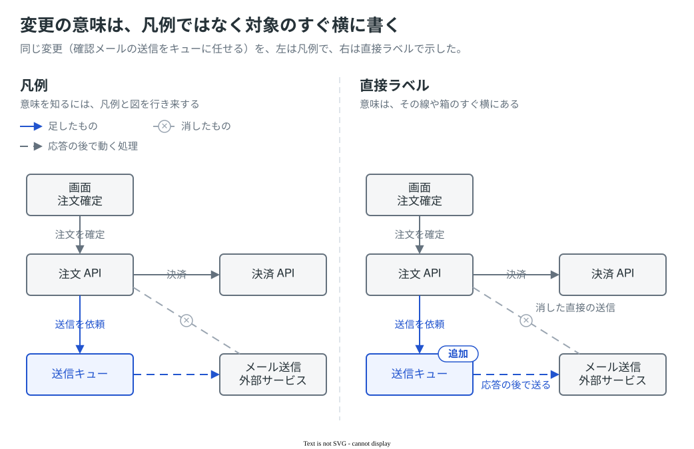
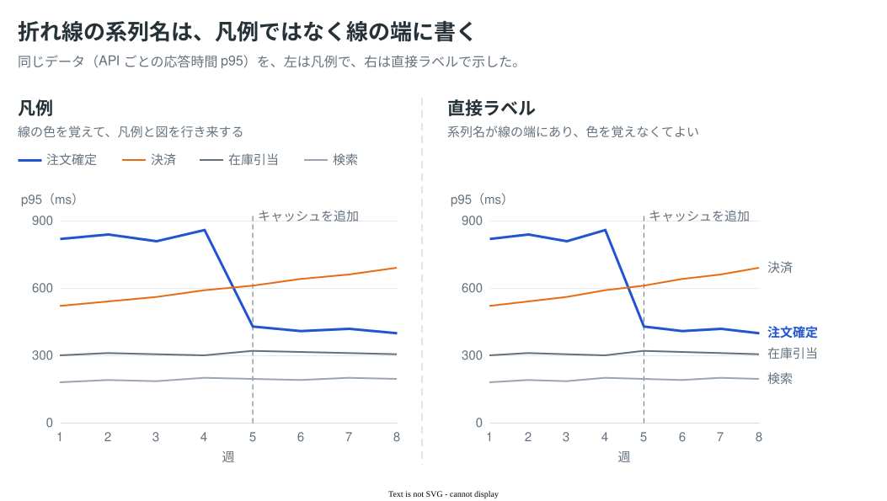

# 図解のプラクティス集

図を読みやすくする作法を、その根拠となる出典の引用とともにまとめる。色・線・大きさの決まりは [references/drawio-style.md](../references/drawio-style.md) に、どんな表現ができるかは [samples/README.md](../samples/README.md) にある。

## 一覧

| プラクティス | 要点 | サンプル |
|---|---|---|
| [意味は対象のすぐ横に書き、凡例は共通の記法に使う](#意味は対象のすぐ横に書き凡例は共通の記法に使う) | 要素・線・系列の意味は、直接ラベルで書く。凡例は、繰り返し使う記法と量の尺度に使う | [direct-labels/](direct-labels/) |

## 意味は対象のすぐ横に書き、凡例は共通の記法に使う

要素、線、グラフの系列が何を表すかは、その対象のすぐ横に書く。これを直接ラベルと呼ぶ。目的は凡例をなくすことではなく、「どれが何か」を確かめるためだけに、凡例と図のあいだを行き来させないことである。

要素名、系列名、変更点、遷移の条件が対象の横にあれば、図だけで読める。一方で、同じ色・線種・記号を図の中で何度も使う記法や、色の濃さや大きさで表す量の尺度は、凡例にまとめたほうが読みやすい。凡例を使うなら、対象の近くに、図の中の並びと同じ順で置く。

直接ラベルが重なったり対象を隠したりするのは、図に載せる要素が多すぎる合図である。名前を短くする、図を分ける、見せたい要素だけに直接ラベルを付けて残りを凡例にまとめる、のどれが合うかは図による。PR 本文の幅（約 814px）に縮めても読めることが条件になる。

UML・BPMN・ER のように記法が決まっている図では、記号の意味を変えない。読み手が知らないかもしれない記号だけを凡例で補う。

ラベルの文字は、白地とのコントラストが 4.5:1 以上の色で書く。この skill の配色では、primary の青（6.5:1）と補足の文字色（5.0:1）は満たすが、secondary の橙（3.2:1）、灰（3.0:1）、薄い灰（2.5:1）は満たさない。これらの色の線の名前は補足の文字色で書き、位置や引き出し線で線と対応させる。

画像の中のラベルはスクリーンリーダーに伝わらないことがあるので、図の要旨と大事な関係や変更は、本文や代替テキストにも書く。

### サンプル

題材と数値は、サンプルのために作った架空のもの。

#### 説明図

確認メールの送信をキューに任せる変更を、左は凡例で、右は直接ラベルで示した。右では「追加」「消した直接の送信」「応答の後で送る」を対象の横に書いたので、凡例と図を行き来しなくても読める。色と線の種類はどちらにも残しており、右では文字でも同じ意味を示している。

#### チャート

API ごとの応答時間 p95 を、左は凡例で、右は線の端の系列名で示した。右では、見てほしい「注文確定」だけを青の太字にし、ほかの系列名は補足の文字色で書いた。橙や薄い灰の線の名前を線と同じ色で書くと、白地とのコントラストが足りないため、文字の色ではなく位置で線と対応させている。

### 根拠

- "The more directly you can label data, the better." / "if you can label the lines directly (for example, at the ends of the lines), the graph will be much easier to read." / "In a bar graph with multiple sets of bars, you usually need a legend, but you can make it much easier to read by arranging the labels to match the arrangement of the bars." — Few, S. (2005). [*Effectively Communicating Numbers*](https://www.perceptualedge.com/articles/Whitepapers/Communicating_Numbers.pdf), p. 17
- "they require readers to look back and forth between the chart and the legend" / "when many elements are close together on a chart, it is tricky to direct label each of them without creating overlapping text." — data.europa.eu. [Direct labelling](https://data.europa.eu/apps/data-visualisation-guide/direct-labelling)
- "Check, and we cannot stress this enough, if these self-placed labels work in the mobile view." — Datawrapper Academy. [What to consider when creating line charts](https://www.datawrapper.de/academy/what-to-consider-when-creating-line-charts)
- "Place annotations as close as possible to the part of the chart they relate to." / "Make sure any essential information you include in annotations is also included in the main text or footnotes." — Office for National Statistics. [Annotations](https://service-manual.ons.gov.uk/data-visualisation/guidance/annotations)
- "people learn more when related words and pictures are displayed spatially near one another" / "58 independent comparisons (n = 2426) produced an overall effect size of g = 0.63" — Schroeder & Cenkci (2018). [Spatial contiguity and spatial split-attention effects in multimedia learning environments: A meta-analysis](https://doi.org/10.1007/s10648-018-9435-9)
- "the integrated groups significantly outperformed the separated groups on transfer test score in Experiment 1(d = .80) and Experiment 2 (d = .73) but not in Experiment 3 (d = .35)" — Johnson & Mayer (2012). [An eye movement analysis of the spatial contiguity effect in multimedia learning](https://doi.org/10.1037/a0026923)（実験 3 の比較対象は "a legend below the diagrams"）
- "data-legend compatibility reduced the time needed to understand graphs" — Huestegge & Philipp (2011). [Effects of spatial compatibility on integration processes in graph comprehension](https://doi.org/10.3758/s13414-011-0155-1)
- "Color is not used as the only visual means of conveying information" / "The visual presentation of text and images of text has a contrast ratio of at least 4.5:1" — W3C. [SC 1.4.1](https://www.w3.org/WAI/WCAG22/Understanding/use-of-color.html) / [SC 1.4.3](https://www.w3.org/WAI/WCAG22/Understanding/contrast-minimum.html)

### 既存のサンプルとの関係

[samples/](../samples/README.md) の図の多くは、見出しの下に凡例を置いている。凡例の置き方は、サンプルよりこのプラクティスを優先する。

## プラクティスを増やす

プラクティスは、ルール、ルールに従った図と従わない図を並べた `.drawio.svg` のサンプル（`practices/<name>/`）、根拠となる出典の引用からなる。[drawio-style.md](../references/drawio-style.md) の決まりと食い違うなら、あわせて直す。
