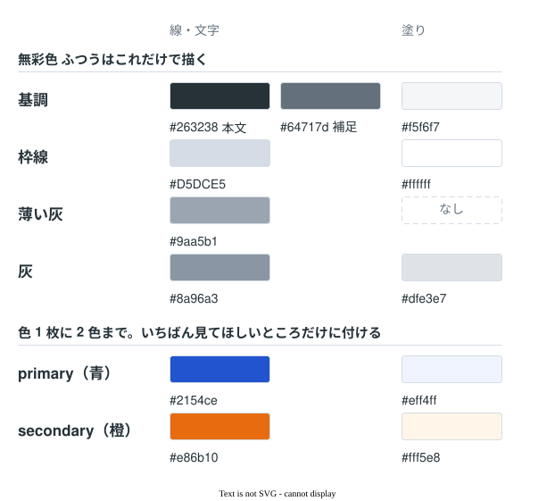
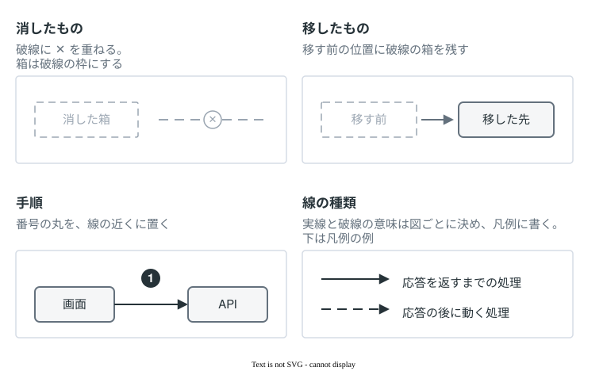

# draw.io の体裁

簡素な構図と落ち着いた文字組みを基本にし、色や文字の強弱は、図に必要な区別へ絞る。

座標、フォントサイズ、線幅は `templates/` の `.drawio.svg` に埋め込んだ XML にある。取り出し方は [drawio-workflow.md](drawio-workflow.md) の「`.drawio.svg` を編集する」にある。

## 図の組み立て

- 見出しと副題の書き方に決まりはない。図ごとに、伝えたいことが伝わる書き方を選ぶ。見本の見出しの形をまねる必要もない。
- 凡例は見出しの下に置き、その図で使う色・線・記号の意味を示す。
- 文字を読まなくても違いが分かるように、配置・囲み・矢印の本数・線の種類で表す。色だけに頼らない。

## 大きさ

文字の大きさより、情報の正確さを優先する。必要な情報を削ったり、ステップをまとめたりしてまで、図を小さく収めない。

GitHub の PR 本文の幅は、デスクトップのブラウザでおよそ 814px になる（ウィンドウ幅 1440px と 1920px で確認）。大きな図はこの幅に縮めて表示され、文字が小さくなるが、読み手が画像を開いて拡大して読めればよい。情報を削らずに済む場合は、幅 1000px 前後・文字 15px 以上で描くと、縮めたままでも読みやすい。見本では、見出しを 26px、副題を 16px にしている。

## 配色

| 名前 | 線・文字 | 塗り |
|---|---|---|
| 基調 | `#64717d`（補足）/ `#263238`（本文） | `#f5f6f7` |
| 枠線 | `#D5DCE5` | `#ffffff` |
| primary（青） | `#2154ce` | `#eff4ff` |
| secondary（橙） | `#e86b10` | `#fff5e8` |
| 薄い灰 | `#9aa5b1` | なし |
| 灰 | `#8a96a3` | `#dfe3e7` |

- 色（primary と secondary）は 1 枚に 2 色までにし、その図でいちばん見てほしいところだけに付ける。ほかは基調と灰で描く。
- 1 枚の中で、1 つの色に 2 つの意味を持たせない。たとえば、凡例で secondary を「やめたもの」としたら、良くなった点を secondary の枠で囲まない。

AWS などのアイコンは提供元の色のまま使う。

## 線と記号

| 表すこと | 描き方 |
|---|---|
| 消したもの | 破線に ✕ を重ねる。箱は破線の枠にする |
| 移したもの | 移す前の位置に破線の箱を残す |
| 手順 | 番号の丸を、線の近くに置く |
| 線の種類 | 実線と破線の意味は図ごとに決め、凡例に書く。例：実線は応答までの処理、破線は応答の後の処理 |

UML、BPMN、C4、ER のように記法が決まっている図は、その記法の矢印と記号を使い、凡例で意味を示す。

## ラベルの書き方

`html=1` のラベル内で `1` と書けば下付きになる。

ラベル内で `<T>` のような角括弧を文字として見せるときは `&amp;lt;T&amp;gt;` と二重にエスケープする。単エスケープだとタグ扱いで消える。
