# explanatory-diagrams：モデルごとの出力

同じ入力（依頼文・資料・画像・skill の中身）を渡したとき、モデルごとに出力がどう変わるかを並べる。skill の説明はリポジトリの [README](../../../README.md)（[日本語](../../../README.ja.md)、[简体中文](../../../README.zh-CN.md)）に、eval の仕組みと実行のしかたは [../README.md](../README.md) にある。

公開している記録は、すべて skill をこのリポジトリに移す前に、dotfiles（非公開）で実行したもの。その時の skill は、図を PNG（`.drawio.png`）で書き出していた。いまの skill は SVG（`.drawio.svg`）で書き出す。その記録の commit（「実行の条件」の表）は移す前のリポジトリのもので、このリポジトリの履歴にはない。

ケースの題材（雑貨店の EC と管理画面）、人名・住所・電話番号・注文番号・数値・業務のルールは、この eval のために作った架空のもの。

この README と `outputs/` は `python3 tests/skill-evals/run_skill_eval.py publish <結果のディレクトリ>` で作り直すので、手で編集しない。どのモデルも実行は 1 回ずつなので、同じモデルでも実行ごとに図は変わる。時間は複数の実行を同時に動かして測ったので、目安にとどめる。Codex CLI は費用を返さないので、Codex のモデルの費用は「—」にしている。

- [aws-infra-change](#aws-infra-change)：商品画像の置き場を EFS から S3 に移すインフラの変更を、メモと Terraform の差分から、PR 本文に載せる図にする
- [design-token-change](#design-token-change)：状態の色の変更を、変更メモと変更前後の画面の画像から、PR 本文に載せる図にする
- [refactor-dependency-inversion](#refactor-dependency-inversion)：出荷の処理の依存の向きを逆にするリファクタリングを、git の差分とメモから、PR 本文に載せる図にする

## aws-infra-change

依頼文（[prompt.md](cases/aws-infra-change/prompt.md)）

> input/ にあるインフラの変更のメモと Terraform の差分をもとに、この変更を PR 本文で説明する図を作って。図は out/ に置いて。

入力（[input/](cases/aws-infra-change/input/)。[setup.sh](cases/aws-infra-change/setup.sh) が作業場所の `input/` に置いて渡す）

- [infra/（10 ファイル）](cases/aws-infra-change/input/infra)
- [infra.diff](cases/aws-infra-change/input/infra.diff)
- [notes.md](cases/aws-infra-change/input/notes.md)

近い見本（skill の中）：[aws-architecture](../../../skills/explanatory-diagrams/templates/aws-architecture/aws-architecture.drawio.svg)、[before-after-diff](../../../skills/explanatory-diagrams/templates/before-after-diff/before-after-diff.drawio.svg)

| モデル | effort | 時間 | 費用の目安 | トークン（入力／出力） | ツール | skill | 出力 |
|---|---|---|---|---|---|---|---|
| [opus-5.5](#aws-infra-change-opus-55) | high | 505 秒 | $2.17 | 1,698,924／40,045 | 20 回 | 読んだ | product-images-s3-cloudfront.drawio.png |
| [sonnet-5](#aws-infra-change-sonnet-5) | high | 940 秒 | $2.07 | 3,251,451／75,296 | 30 回 | 読んだ | product-images-s3-cloudfront.drawio.png |
| [haiku-4.5](#aws-infra-change-haiku-45) | high | 127 秒 | $0.26 | 799,435／14,556 | 16 回 | 読んだ | diagram.png |
| [fable-5.1](#aws-infra-change-fable-51) | high | 627 秒 | $5.06 | 1,183,544／41,835 | 27 回 | 読んだ | product-images-s3.drawio.png |
| [gpt-6-astra](#aws-infra-change-gpt-6-astra) | high | 253 秒 | — | 493,117／6,401 | 15 回 | 読んだ | product-images.drawio.png |
| [gpt-6-sol](#aws-infra-change-gpt-6-sol) | xhigh | 301 秒 | — | 590,117／14,042 | 20 回 | 読んだ | product-images.drawio.png |
| [gpt-6-luna](#aws-infra-change-gpt-6-luna) | xhigh | 623 秒 | — | 778,854／28,773 | 27 回 | 読んだ | product-images.drawio.png |

<a id="aws-infra-change-opus-55"></a>

### opus-5.5

`claude-opus-5-5`、effort high、2026-09-26T13:01:00 に実行

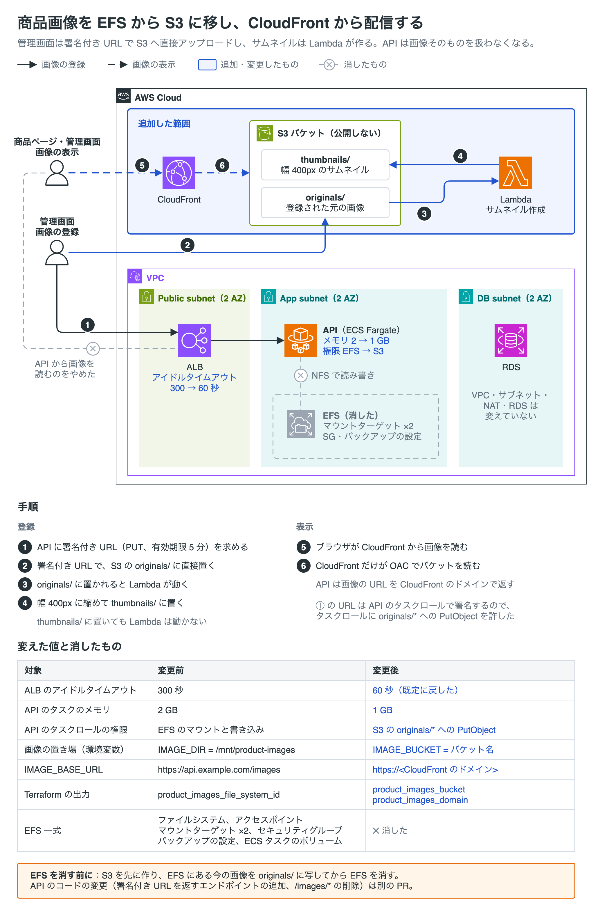


<details><summary>最後の返答</summary>

~~~~text
図を 1 枚作り、`out/product-images-s3-cloudfront.drawio.png` に置きました。編集元の XML を埋め込んであるので、draw.io で開けばそのまま直せます。書き出した PNG を見て、文字の折り返しや重なりがないことを確かめました。

**描き方**：変更後の AWS 構成図に差分を重ねました。

- **上段（青の枠）**：追加したもの。CloudFront、S3 バケット（`originals/` と `thumbnails/` を分けて描いています）、サムネイルを作る Lambda です。
- **下段（VPC）**：
  - ALB はアイドルタイムアウト 300 → 60 秒、API はメモリ 2 → 1 GB と権限 EFS → S3 を、青の文字で添えました。
  - EFS 一式は灰の破線の枠と ✕ で、消したことを示しています。
  - VPC・サブネット・NAT・RDS は変えていないと書き添えました。
- **流れの番号**：
  - 登録は実線で ①〜④。署名付き URL をもらう → S3 に直接 PUT → Lambda が動く → サムネイルを置く、の順です。
  - 表示は破線で ⑤⑥。ブラウザが CloudFront から読み、CloudFront だけが OAC でバケットを読みます。
- **消した経路**：これまでの「ブラウザ → ALB → API が EFS から読んで返す」経路を、灰の破線と ✕ で残しました。
- **図の下**：手順の説明と、変更前後の値の表を付けました。表の中身は、アイドルタイムアウト、メモリ、タスクロール、環境変数、`IMAGE_BASE_URL`、Terraform の出力、消した EFS 一式です。
- **橙の注意書き**：「EFS を消す前に、今の画像を S3 の `originals/` に写す」順序と、「API のコードの変更は別の PR」であることを書きました。

気になるかもしれない点が 2 つあります。

- 図には `/images/*` をやめたことを描いていますが、この経路を実際になくすのは別の PR（API のコード）です。そのため注意書きで別の PR だと断っています。
- 画像の流れに関係しないので、API から RDS への線は描いていません。

PR 本文に貼るときは次のように添付できます。

```bash
gh pr edit <number> --body-file body.md --attach './out/product-images-s3-cloudfront.drawio.png#商品画像を S3 と CloudFront に移す構成の変更'
```
~~~~

</details>

<a id="aws-infra-change-sonnet-5"></a>

### sonnet-5

`claude-sonnet-5`、effort high、2026-09-26T13:01:00 に実行

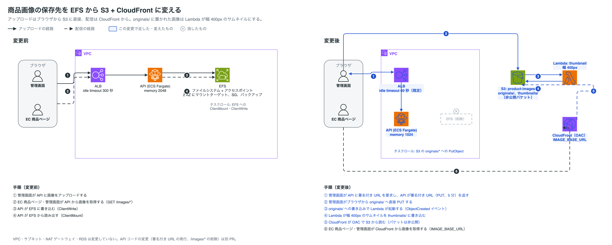


<details><summary>最後の返答</summary>

~~~~text
`out/product-images-s3-cloudfront.drawio.png` を作成した。

- notes.md と infra.diff を基に、EFS 経由の配信から S3 + CloudFront + Lambda 構成への変更を「変更前」「変更後」を左右に並べた AWS 構成図で説明している。
- アップロードの経路（実線）と配信の経路（破線）を区別し、番号は下部の手順リストと対応させた。
- ECS のメモリ（2048→1024）、ALB のアイドルタイムアウト（300秒→既定60秒）、タスクロールの権限変更、EFS 一式の削除（灰色破線+✕）も反映した。
- draw.io で開けば編集元の XML も含まれている（`.drawio.png`）ので、PR に添付する際は `gh pr edit --attach` でそのまま使える。

VPC・サブネット・NAT・RDS は変更なしとして図中に注記済み。
~~~~

</details>

<a id="aws-infra-change-haiku-45"></a>

### haiku-4.5

`claude-haiku-4-5-20251001`、effort high、2026-09-26T13:01:00 に実行

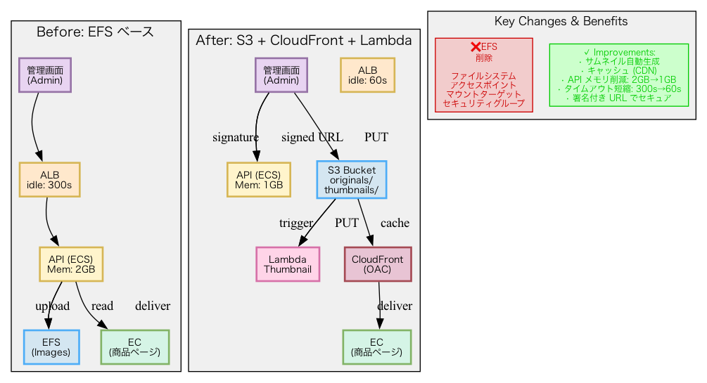


<details><summary>最後の返答</summary>

~~~~text
完了しました！商品画像配信アーキテクチャの Before/After 図を作成し、`out/diagram.png` に保存しました。

図の内容：
- **Before（左）**: EFS ベースの構成 — API が画像をすべて処理（メモリ 2GB、タイムアウト 300s）
- **After（中央）**: S3 + CloudFront + Lambda の構成 — ブラウザから S3 に直接アップロード、Lambda でサムネイル自動生成、CloudFront でキャッシュ配信（メモリ 1GB、タイムアウト 60s）
- **Key Changes（右）**: 削除されるリソース（EFS 全体）と改善点（サムネイル自動生成、CDN キャッシュ、リソース削減）

この図は PR 本文に貼り付けて、変更の全体像を説明するのに使えます。
~~~~

</details>

<a id="aws-infra-change-fable-51"></a>

### fable-5.1

`claude-fable-5-1`、effort high、2026-09-26T13:01:00 に実行

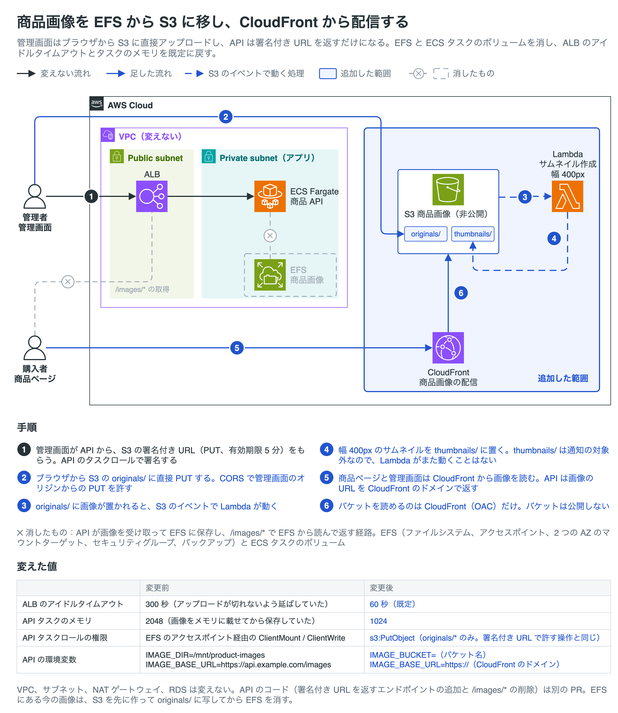


<details><summary>最後の返答</summary>

~~~~text
図を `out/product-images-s3.drawio.png` に書き出しました。編集元の XML を埋め込んだ PNG なので、draw.io で開けばそのまま編集できます。

図の内容は、変更後の AWS 構成図に差分を重ねた 1 枚です。

- **足した範囲（青枠）** に S3（originals/ と thumbnails/）、サムネイル作成の Lambda、CloudFront を置き、管理画面からの直接 PUT、S3 イベントでの Lambda 起動、CloudFront からの配信を番号付きの流れで示しています。
- **消したもの（灰の破線と ✕）** として、ECS タスクから EFS への読み書きと、購入者が API の /images/* から画像を取る経路を残しています。EFS は破線の枠で囲みました。
- **手順** を 6 つ並べ、変えない手順（署名付き URL の取得）は黒、足した手順は青にしています。
- **変えた値** の表に、ALB のアイドルタイムアウト、タスクのメモリ、タスクロールの権限、環境変数の変更前後を載せました。
- 末尾に、VPC や RDS は変えないこと、API のコードは別 PR であること、EFS の画像の移行順を注記しています。

PR 本文へ貼るときは次のように添付できます。

```bash
gh pr edit -R <owner/repo> <number> --body-file body.md --attach './out/product-images-s3.drawio.png#商品画像を S3 と CloudFront に移す構成の変更'
```
~~~~

</details>

<a id="aws-infra-change-gpt-6-astra"></a>

### gpt-6-astra

`gpt-6-astra`、effort high、2026-09-26T13:01:00 に実行

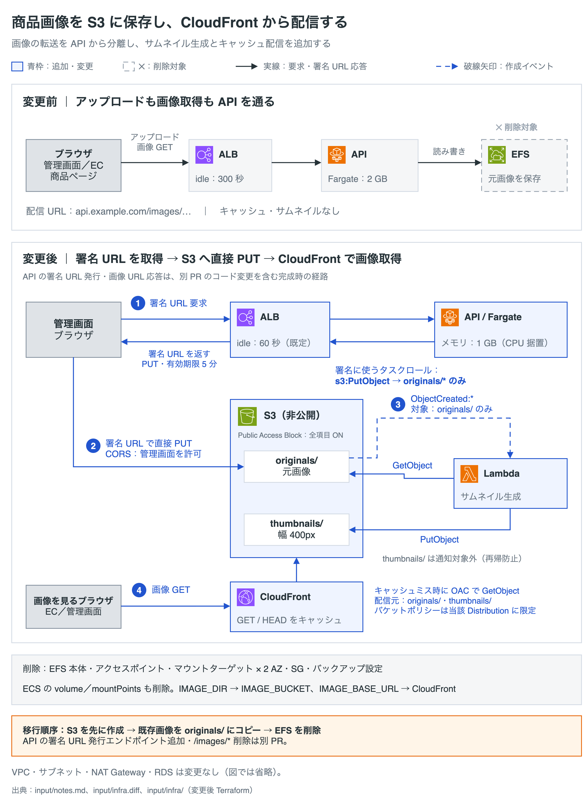


<details><summary>最後の返答</summary>

~~~~text
[PR 本文用の図](out/product-images.drawio.png)を作成しました。

変更前後の経路、権限、サムネイル生成、EFS の削除範囲と移行順序を記載しています。PNG は draw.io で再編集できます。
~~~~

</details>

<a id="aws-infra-change-gpt-6-sol"></a>

### gpt-6-sol

`gpt-6-sol`、effort xhigh、2026-09-26T13:01:00 に実行

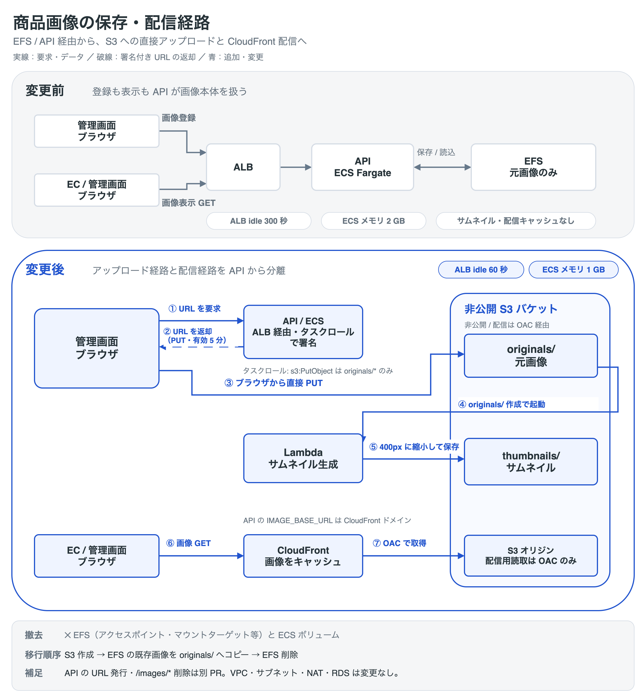


<details><summary>最後の返答</summary>

~~~~text
PR 本文用の図を [out/product-images.drawio.png](<workspace>/out/product-images.drawio.png) に作成しました。

変更前後の登録・配信経路、サムネイル生成、EFS の撤去と画像の移行順序を示しています。PNG を確認済みで、draw.io で再編集できます。
~~~~

</details>

<a id="aws-infra-change-gpt-6-luna"></a>

### gpt-6-luna

`gpt-6-luna`、effort xhigh、2026-09-26T13:01:00 に実行

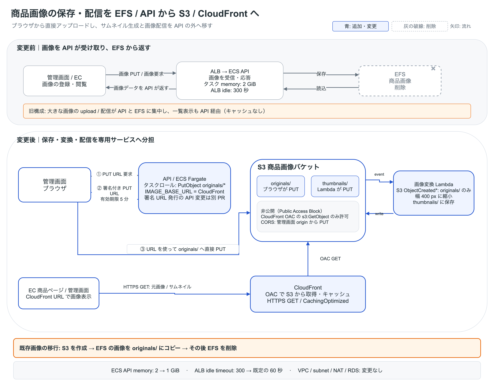


<details><summary>最後の返答</summary>

~~~~text
PR本文用の図を [product-images.drawio.png](<workspace>/out/product-images.drawio.png) に作成しました。変更前後の画像フロー、5分有効の署名付き PUT、サムネイル生成、CloudFront の OAC 配信、既存画像の移行順をまとめています。

PNG を書き出して表示を確認済みです。draw.io の編集データも PNG に埋め込んであります。
~~~~

</details>

### 実行の条件

依頼文の sha256 `0f268ec287e4`、入力の sha256 `b14d936e6839`。

| モデル | 実行日時 | skill の sha256 | commit | CLI |
|---|---|---|---|---|
| opus-5.5 | 2026-09-26T13:01:00 | `82b734928608` | `ccb5e79`、移す前の dotfiles（非公開） | 2.1.282 (Claude Code) |
| sonnet-5 | 2026-09-26T13:01:00 | `82b734928608` | `ccb5e79`、移す前の dotfiles（非公開） | 2.1.282 (Claude Code) |
| haiku-4.5 | 2026-09-26T13:01:00 | `82b734928608` | `ccb5e79`、移す前の dotfiles（非公開） | 2.1.282 (Claude Code) |
| fable-5.1 | 2026-09-26T13:01:00 | `82b734928608` | `ccb5e79`、移す前の dotfiles（非公開） | 2.1.282 (Claude Code) |
| gpt-6-astra | 2026-09-26T13:01:00 | `82b734928608` | `ccb5e79`、移す前の dotfiles（非公開） | codex-cli 0.156.0 |
| gpt-6-sol | 2026-09-26T13:01:00 | `82b734928608` | `ccb5e79`、移す前の dotfiles（非公開） | codex-cli 0.156.0 |
| gpt-6-luna | 2026-09-26T13:01:00 | `82b734928608` | `ccb5e79`、移す前の dotfiles（非公開） | codex-cli 0.156.0 |

環境の注意書き（どのモデルにも同じ文で渡した）：この環境では、シェルのコマンドは OS のサンドボックスの中で動く。draw.io の書き出し（/Applications/draw.io.app/Contents/MacOS/draw.io -x ...）だけはサンドボックスの外で動くが、ほかのコマンドと &&、;、パイプ、改行でつなげず、単独で実行したときに限る。つなげるとサンドボックスの中で動き、異常終了する。

## design-token-change

依頼文（[prompt.md](cases/design-token-change/prompt.md)）

> input/ にあるデザイン変更のメモと画面の画像をもとに、この変更を PR 本文で説明する図を作って。図は out/ に置いて。

入力（[input/](cases/design-token-change/input/)。[setup.sh](cases/design-token-change/setup.sh) が作業場所の `input/` に置いて渡す）

- [design-change.md](cases/design-token-change/input/design-change.md)

<table><tr>
<td><br><code>screenshots/before/delivery-form.png</code></td>
<td><br><code>screenshots/before/orders.png</code></td>
<td><br><code>screenshots/after/delivery-form.png</code></td>
<td><br><code>screenshots/after/orders.png</code></td>
</tr></table>

近い見本（skill の中）：[design-before-after](../../../skills/explanatory-diagrams/templates/design-before-after/design-before-after.drawio.svg)

| モデル | effort | 時間 | 費用の目安 | トークン（入力／出力） | ツール | skill | 出力 |
|---|---|---|---|---|---|---|---|
| [opus-5.5](#design-token-change-opus-55) | high | 272 秒 | $1.34 | 1,500,494／21,496 | 24 回 | 読んだ | status-colors.drawio.png |
| [sonnet-5](#design-token-change-sonnet-5) | high | 922 秒 | $2.55 | 6,391,539／69,162 | 54 回 | 読んだ | status-color-change.drawio.png |
| [haiku-4.5](#design-token-change-haiku-45) | high | 182 秒 | $0.14 | 657,738／7,703 | 15 回 | 読んだ | color-palette.png |
| [fable-5.1](#design-token-change-fable-51) | high | 300 秒 | $2.87 | 1,421,971／21,353 | 30 回 | 読んだ | status-colors.drawio.png |
| [gpt-6-astra](#design-token-change-gpt-6-astra) | high | 206 秒 | — | 312,825／4,962 | 18 回 | 読んだ | status-colors.drawio.png |
| [gpt-6-sol](#design-token-change-gpt-6-sol) | xhigh | 383 秒 | — | 825,125／12,572 | 26 回 | 読んだ | status-colors.drawio.png |
| [gpt-6-luna](#design-token-change-gpt-6-luna) | xhigh | 388 秒 | — | 855,473／16,772 | 28 回 | 読んだ | state-colors.drawio.png |

<a id="design-token-change-opus-55"></a>

### opus-5.5

`claude-opus-5-5`、effort high、2026-09-26T13:01:03 に実行

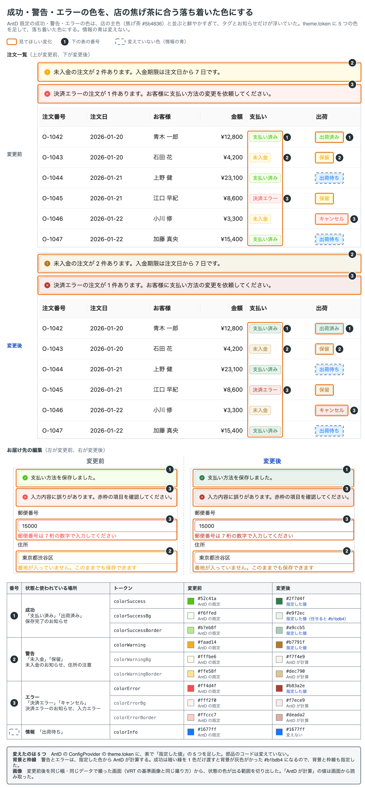


<details><summary>最後の返答</summary>

~~~~text
図を 1 枚作り、`out/status-colors.drawio.png` に置きました。draw.io で開くと、そのまま編集できます。

**図の中身**（skill の「画面を並べてデザインの変化を比べる」の見本に合わせた体裁です）
- **注文一覧**：横に長い画面なので、変更前と変更後を上下に並べました。
  - 警告とエラーのお知らせ、「支払い」の列、「出荷」の列で色が変わったタグを、橙の枠で囲んでいます。
  - 青のまま変えていない「出荷待ち」は、灰色の破線で囲みました。
- **お届け先の編集**：変更前と変更後を左右に並べました。保存完了のお知らせ、入力エラーのお知らせ、郵便番号の入力エラー、住所の注意を枠で囲んでいます。
- **トークンの表**：画面につけた番号 ①成功、②警告、③エラーと、表の行を対応させています。
  - 変更前と変更後の色の見本と値を載せました。
  - 自分で指定した 5 つの値は青、AntD が計算した値は灰色の文字にしています。
  - 変えていない情報（info）の色も 1 行入れました。
- **下の注記**：部品のコードは変えていないこと、成功だけ背景と枠線も指定した理由（計算に任せると背景が `#b1bdb4` になる）を書いています。

**確かめたこと**
- 変更前後の画像を比べて、色が変わった範囲を出し、枠の位置を決めました。「出荷待ち」が変わっていないことも、この比較で確かめています。
- 画像から読んだ色は、メモにある値とすべて一致しました。

**確認してほしいこと**
- 表の「AntD が計算」の行のうち、警告とエラーの**枠線の色**（`#dec790`、`#deada2`）はメモにありません。画面の画像から読み取った値です。そのことは図の中にも書いています。
- ファイルは約 1.9MB あり、図の高さが幅の 2 倍を超えます。PR 本文の幅に縮めると画面の文字が小さくなりますが、画像を開いて拡大すれば読めます。

PR 本文に貼るときは、`gh pr edit <番号> --body-file body.md --attach './out/status-colors.drawio.png#状態の色の変更前後'` のように添付できます。
~~~~

</details>

<a id="design-token-change-sonnet-5"></a>

### sonnet-5

`claude-sonnet-5`、effort high、2026-09-26T13:01:03 に実行

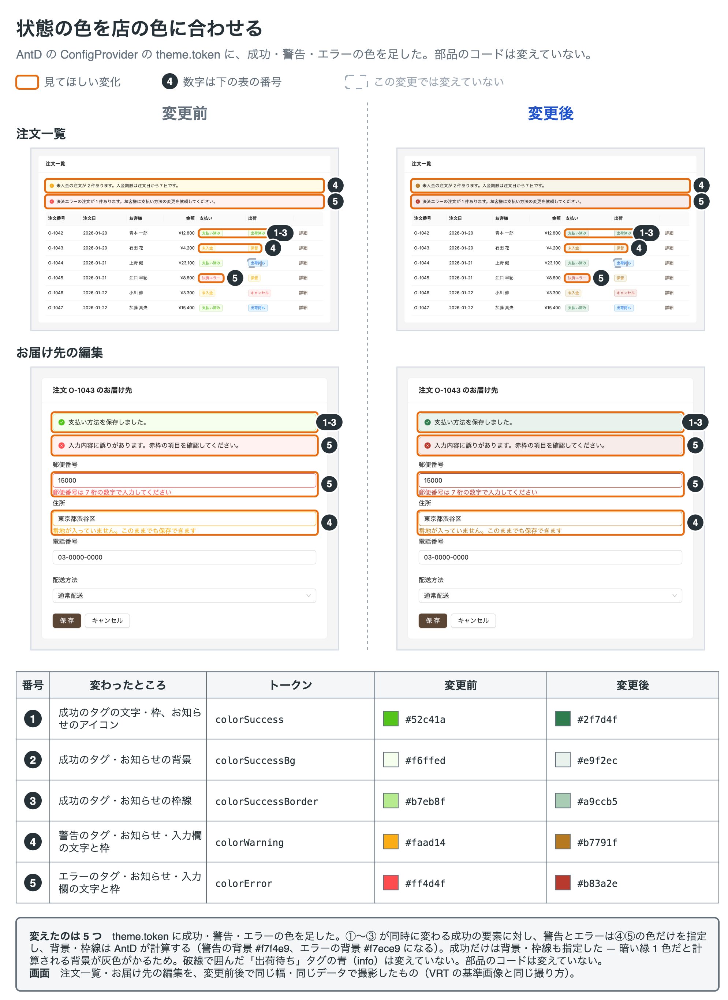


<details><summary>最後の返答</summary>

~~~~text
`out/status-color-change.drawio.png` を作成しました。

- 注文一覧・お届け先の編集の実画面（変更前後）を並べ、変わったタグ・お知らせ・入力欄を橙枠と番号（下表と対応）で示しています。
- 下に `colorSuccess`〜`colorError` の5トークンの変更前後の値を表でまとめ、`出荷待ち`（info の青）は変えていないことも破線枠で明示しています。
- PNG は draw.io 形式で編集元 XML を埋め込んでいるので、そのまま draw.io で開いて修正できます。PR に貼る際は `gh pr edit ... --attach './out/status-color-change.drawio.png#alt'` のように添付してください。
~~~~

</details>

<a id="design-token-change-haiku-45"></a>

### haiku-4.5

`claude-haiku-4-5-20251001`、effort high、2026-09-26T13:01:03 に実行

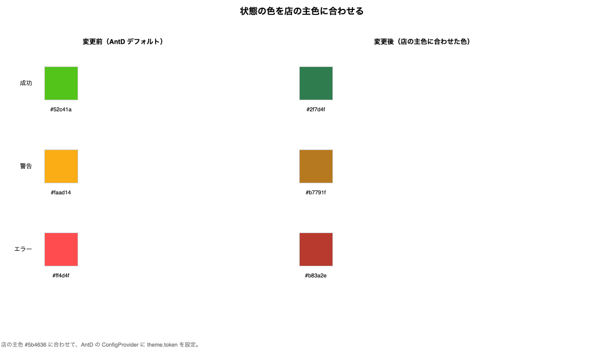


<details><summary>最後の返答</summary>

~~~~text
完成しました！色パレット比較図が out/color-palette.png に生成されました。

**図の内容：**
- **タイトル**：「状態の色を店の主色に合わせる」
- **左側（変更前）**：AntD デフォルトの鮮やかな色
  - 成功：#52c41a（明るい緑）
  - 警告：#faad14（オレンジ）
  - エラー：#ff4d4f（赤）
- **右側（変更後）**：店の主色 #5b4636 に合わせた色
  - 成功：#2f7d4f（深い緑）
  - 警告：#b7791f（黄茶色）
  - エラー：#b83a2e（赤褐色）
- **注記**：設定方法（ConfigProvider の theme.token）を明記

変更前後の色の違いが視覚的に伝わり、PR 本文で説明するのに最適です。
~~~~

</details>

<a id="design-token-change-fable-51"></a>

### fable-5.1

`claude-fable-5-1`、effort high、2026-09-26T13:01:03 に実行

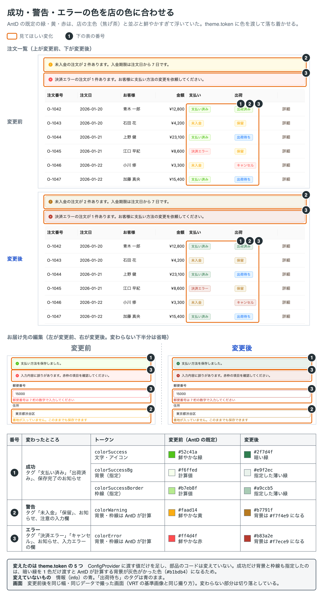


<details><summary>最後の返答</summary>

~~~~text
図を `out/status-colors.drawio.png` に置きました。編集元の XML を埋め込んだ PNG なので、draw.io で開くとそのまま編集できます。

**図の構成**（幅 1000px で描き、2 倍で書き出し）

- **注文一覧**は横長なので上下に並べ、警告のお知らせ、エラーのお知らせ、「支払い」「出荷」のタグ列を橙の枠で囲んで番号を付けました。カードの見出しと下の余白は切り落としています。
- **お届け先の編集**は変更のある上半分だけ切り出して左右に並べ、保存完了のお知らせ、入力エラーのお知らせ、郵便番号の欄、住所の欄に番号を付けました。
- **表**は番号ごとに、変わったところ、トークン、変更前（AntD の既定）、変更後を色見本つきで並べています。成功だけ 3 トークンなので 1 つの番号に 3 行をまたがせました。警告とエラーは、AntD が計算する背景色も添えています。
- **注記**に、成功だけ背景と枠線も指定した理由（計算値が灰色がかった `#b1bdb4` になる）、情報の青は変えていないこと、画面の撮り方を書きました。

**PR への貼り付け**は次のコマンドでできます。

```bash
gh pr edit -R <owner/repo> <number> --body-file body.md --attach './out/status-colors.drawio.png#状態の色の変更前後'
```

注意点として、お届け先の編集の画面は左右に並べた分だけ文字が小さく、PR の表示幅では色の違いは分かりますが文字は画像を開いて読む前提です。
~~~~

</details>

<a id="design-token-change-gpt-6-astra"></a>

### gpt-6-astra

`gpt-6-astra`、effort high、2026-09-26T12:36:42 に実行

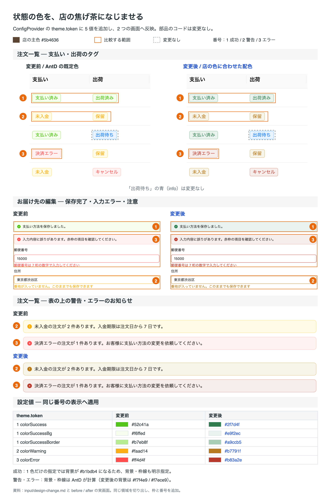


<details><summary>最後の返答</summary>

~~~~text
[図を out/status-colors.drawio.png に作成しました。](<workspace>/out/status-colors.drawio.png)

実画面の前後比較、変更した5つの設定値、成功の背景・枠線を指定した理由をまとめています。PR に貼り付けられ、draw.io で再編集できます。
~~~~

</details>

<a id="design-token-change-gpt-6-sol"></a>

### gpt-6-sol

`gpt-6-sol`、effort xhigh、2026-09-26T12:36:42 に実行

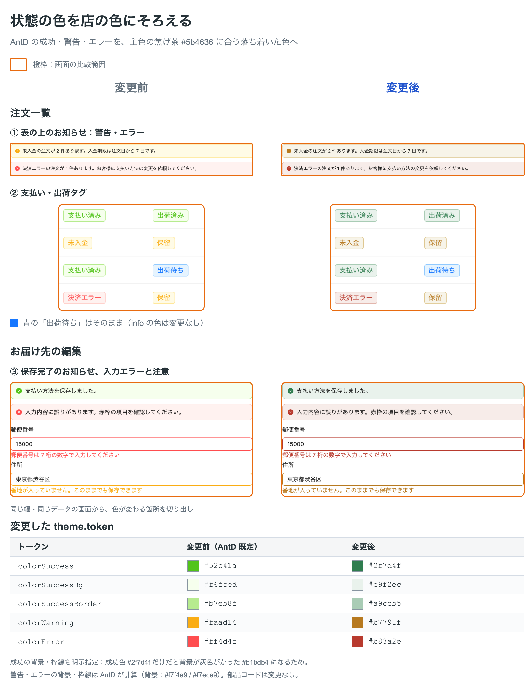


<details><summary>最後の返答</summary>

~~~~text
PR 本文用の図を [out/status-colors.drawio.png](<workspace>/out/status-colors.drawio.png) に作成しました。

注文一覧とお届け先編集の画面を変更前後で並べ、変更したトークン値と、青の「出荷待ち」は変わらないことを示しています。書き出した画像を確認済みで、PNG には draw.io の編集用データも埋め込んであります。
~~~~

</details>

<a id="design-token-change-gpt-6-luna"></a>

### gpt-6-luna

`gpt-6-luna`、effort xhigh、2026-09-26T12:36:42 に実行

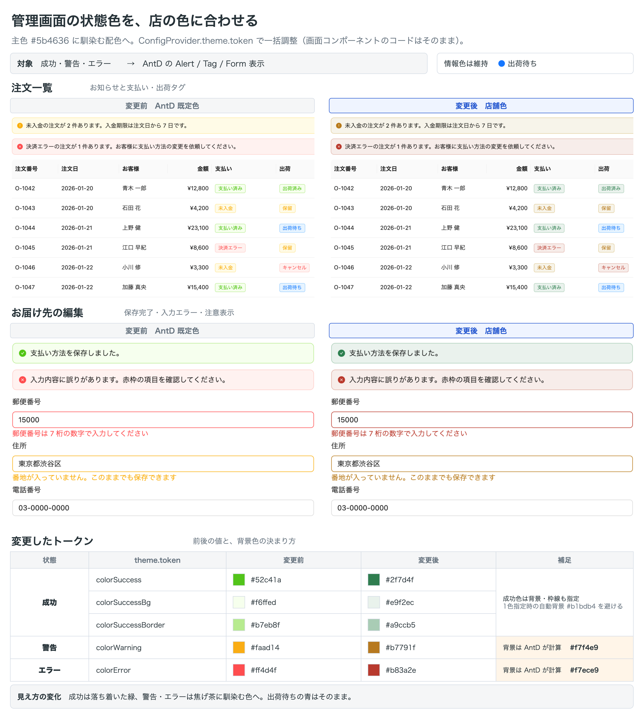


<details><summary>最後の返答</summary>

~~~~text
図を [state-colors.drawio.png](<workspace>/out/state-colors.drawio.png) に作成しました。前後の画面比較、トークン値、背景色の指定・計算方法、変更しない情報色をまとめています。PNGにはdraw.ioの編集データも埋め込んであります。
~~~~

</details>

### 実行の条件

依頼文の sha256 `ac3458846543`、入力の sha256 `65f3ee26ecf7`。

| モデル | 実行日時 | skill の sha256 | commit | CLI |
|---|---|---|---|---|
| opus-5.5 | 2026-09-26T13:01:03 | `82b734928608` | `ccb5e79`、移す前の dotfiles（非公開） | 2.1.282 (Claude Code) |
| sonnet-5 | 2026-09-26T13:01:03 | `82b734928608` | `ccb5e79`、移す前の dotfiles（非公開） | 2.1.282 (Claude Code) |
| haiku-4.5 | 2026-09-26T13:01:03 | `82b734928608` | `ccb5e79`、移す前の dotfiles（非公開） | 2.1.282 (Claude Code) |
| fable-5.1 | 2026-09-26T13:01:03 | `82b734928608` | `ccb5e79`、移す前の dotfiles（非公開） | 2.1.282 (Claude Code) |
| gpt-6-astra | 2026-09-26T12:36:42 | `82b734928608` | `ccb5e79`、移す前の dotfiles（非公開） | codex-cli 0.156.0 |
| gpt-6-sol | 2026-09-26T12:36:42 | `82b734928608` | `ccb5e79`、移す前の dotfiles（非公開） | codex-cli 0.156.0 |
| gpt-6-luna | 2026-09-26T12:36:42 | `82b734928608` | `ccb5e79`、移す前の dotfiles（非公開） | codex-cli 0.156.0 |

環境の注意書き（どのモデルにも同じ文で渡した）：この環境では、シェルのコマンドは OS のサンドボックスの中で動く。draw.io の書き出し（/Applications/draw.io.app/Contents/MacOS/draw.io -x ...）だけはサンドボックスの外で動くが、ほかのコマンドと &&、;、パイプ、改行でつなげず、単独で実行したときに限る。つなげるとサンドボックスの中で動き、異常終了する。

## refactor-dependency-inversion

依頼文（[prompt.md](cases/refactor-dependency-inversion/prompt.md)）

> repo/ の今のブランチのリファクタリングを、PR 本文で説明する図にして。main との差分と notes.md を見て。図はこのディレクトリの out/ に置いて。

入力（[input/](cases/refactor-dependency-inversion/input/)。[setup.sh](cases/refactor-dependency-inversion/setup.sh) が、`input/before` を main、`input/after` を作業ブランチのコミットにした git リポジトリ `repo/` と、`notes.md` を作業場所に置く）

- [after/（13 ファイル）](cases/refactor-dependency-inversion/input/after)
- [before/（9 ファイル）](cases/refactor-dependency-inversion/input/before)
- [notes.md](cases/refactor-dependency-inversion/input/notes.md)

近い見本（skill の中）：[before-after-split](../../../skills/explanatory-diagrams/templates/before-after-split/before-after-split.drawio.svg)、[refactor-extract-module](../../../skills/explanatory-diagrams/templates/refactor-extract-module/refactor-extract-module.drawio.svg)

| モデル | effort | 時間 | 費用の目安 | トークン（入力／出力） | ツール | skill | 出力 |
|---|---|---|---|---|---|---|---|
| [opus-5.5](#refactor-dependency-inversion-opus-55) | high | 260 秒 | $1.18 | 873,053／23,911 | 15 回 | 読んだ | shipping-ports.drawio.png |
| [sonnet-5](#refactor-dependency-inversion-sonnet-5) | high | 528 秒 | $1.34 | 2,224,754／52,175 | 33 回 | 読んだ | shipping-ports-refactor.drawio.png |
| [haiku-4.5](#refactor-dependency-inversion-haiku-45) | high | 169 秒 | $0.25 | 1,161,307／14,004 | 24 回 | 読んだ | refactor-shipping-ports.png（out/ の外） |
| [fable-5.1](#refactor-dependency-inversion-fable-51) | high | 535 秒 | $4.36 | 1,365,694／41,802 | 25 回 | 読んだ | shipping-ports.drawio.png |
| [gpt-6-astra](#refactor-dependency-inversion-gpt-6-astra) | high | 235 秒 | — | 321,842／6,123 | 12 回 | 読んだ | shipping-refactor.drawio.png |
| [gpt-6-sol](#refactor-dependency-inversion-gpt-6-sol) | xhigh | 548 秒 | — | 1,233,941／19,981 | 36 回 | 読んだ | shipping-ports.drawio.png |
| [gpt-6-luna](#refactor-dependency-inversion-gpt-6-luna) | xhigh | 844 秒 | — | 1,202,978／26,387 | 26 回 | 読んだ | shipping-refactor.drawio.png |

<a id="refactor-dependency-inversion-opus-55"></a>

### opus-5.5

`claude-opus-5-5`、effort high、2026-09-26T13:01:00 に実行

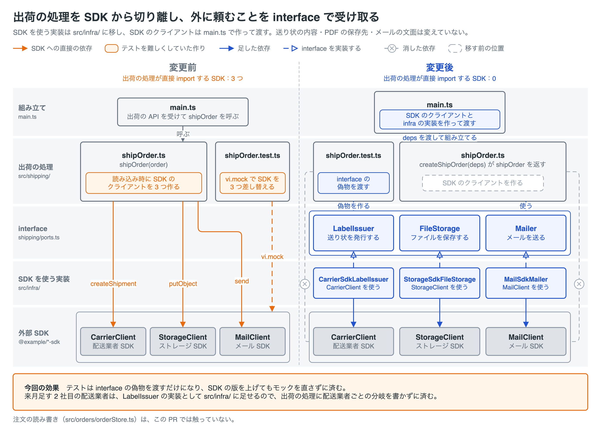


<details><summary>最後の返答</summary>

~~~~text
図を作って `out/` に置きました。

**出力:** `out/shipping-ports.drawio.png`（2 倍で書き出し。編集元の XML を埋め込んであるので、draw.io で開けばそのまま直せます）

**図の組み立て**
- 変更前と変更後を左右に並べ、5 つの帯を両側で揃えました。帯は上から、組み立て（main.ts）→ 出荷の処理 → interface（ports.ts）→ SDK を使う実装（src/infra/）→ 外部 SDK です。
- **変更前**：`shipOrder.ts` から 3 つの SDK へ、橙の矢印を直接引いています。矢印には `createShipment` / `putObject` / `send` と書きました。「読み込み時に SDK のクライアントを 3 つ作る」と、テストの「vi.mock で SDK を 3 つ差し替える」は橙の枠で示しています。
- **変更後**：`LabelIssuer` / `FileStorage` / `Mailer`、`src/infra/` の 3 つの実装、main.ts でクライアントを作って渡す部分を青で示しました。実装から interface へは、UML の実装の矢印（破線に白抜きの三角）を引いています。前の直接の依存と `vi.mock` は、灰の破線に ✕ で残しました。
- 見出しの下に、出荷の処理が直接 import する SDK の数を「3 つ → 0」と添えました。

**文言について**
- 副題に「送り状の内容・PDF の保存先・メールの文面は変えていない」、図の下に「orderStore.ts はこの PR では触っていない」と入れました。どちらも notes.md の記述です。
- 「今回の効果」の欄に 2 社目の配送業者のことを書きました。「LabelIssuer の実装として足せるので、出荷の処理に分岐を書かずに済む」という書き方は、差分から読み取った私の解釈です。この PR ではまだ入れていないので、言い過ぎだと感じたら削ります。

**直すと良いところ**
- 図の幅が約 1300px あるので、PR 本文では縮めて表示されます。細部は、画像を開いて拡大して読む前提です。
- 「呼ぶ」「使う」「偽物を作る」の短い矢印では、矢じりがラベルに少し隠れています。気になれば直します。

PR に貼るときは `gh pr edit <番号> --body-file body.md --attach './out/shipping-ports.drawio.png#出荷の処理から SDK を切り離す変更の前後'` のように添付できます。
~~~~

</details>

<a id="refactor-dependency-inversion-sonnet-5"></a>

### sonnet-5

`claude-sonnet-5`、effort high、2026-09-26T13:01:00 に実行

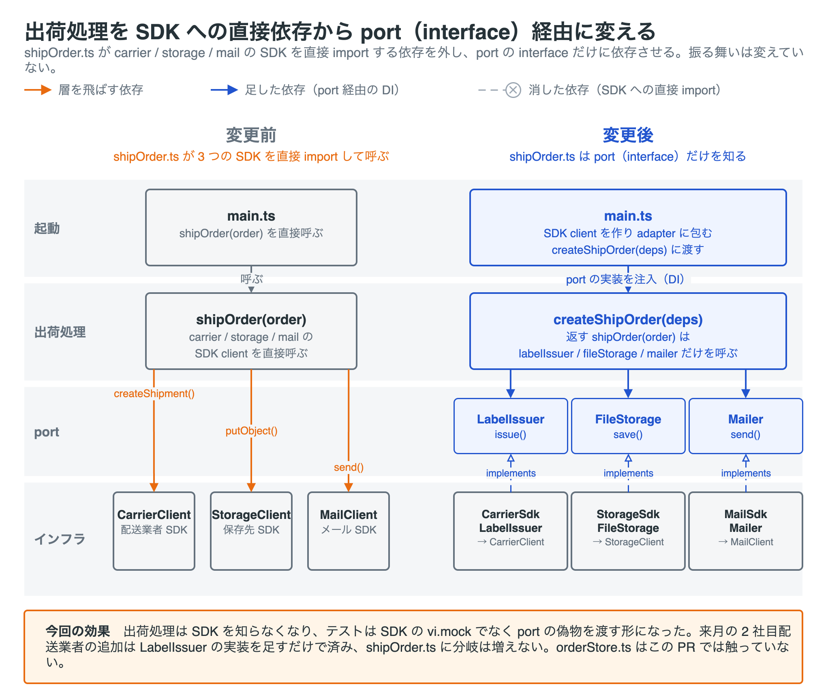


<details><summary>最後の返答</summary>

~~~~text
`work/out/shipping-ports-refactor.drawio.png` に置きました。draw.io で開けば編集もできます（`.drawio.png` は編集元 XML を埋め込んだ形式）。

図の内容：
- **変更前**：`shipOrder.ts` が `main.ts` から呼ばれ、`CarrierClient`/`StorageClient`/`MailClient` の SDK を直接 import して呼ぶ（層を飛ばす依存、橙）。
- **変更後**：`main.ts` が SDK client を作り `src/infra/` の adapter に包んで `createShipOrder(deps)` に注入（DI、青）。`shipOrder` は `LabelIssuer`/`FileStorage`/`Mailer` という port（`ports.ts`）だけを知り、adapter がその port を実装（`implements`）して SDK を呼ぶ。
- 下部に今回の効果（テストが port の偽物差し替えになったこと、来月の配送業者追加が `LabelIssuer` 実装の追加だけで済むこと、`orderStore.ts` は対象外であること）を注記しています。

PR 本文にこの画像を貼る場合は `gh pr edit --attach` で添付してください（`.drawio.png` 自体はリポジトリにコミットしない運用です）。
~~~~

</details>

<a id="refactor-dependency-inversion-haiku-45"></a>

### haiku-4.5

`claude-haiku-4-5-20251001`、effort high、2026-09-26T13:01:00 に実行

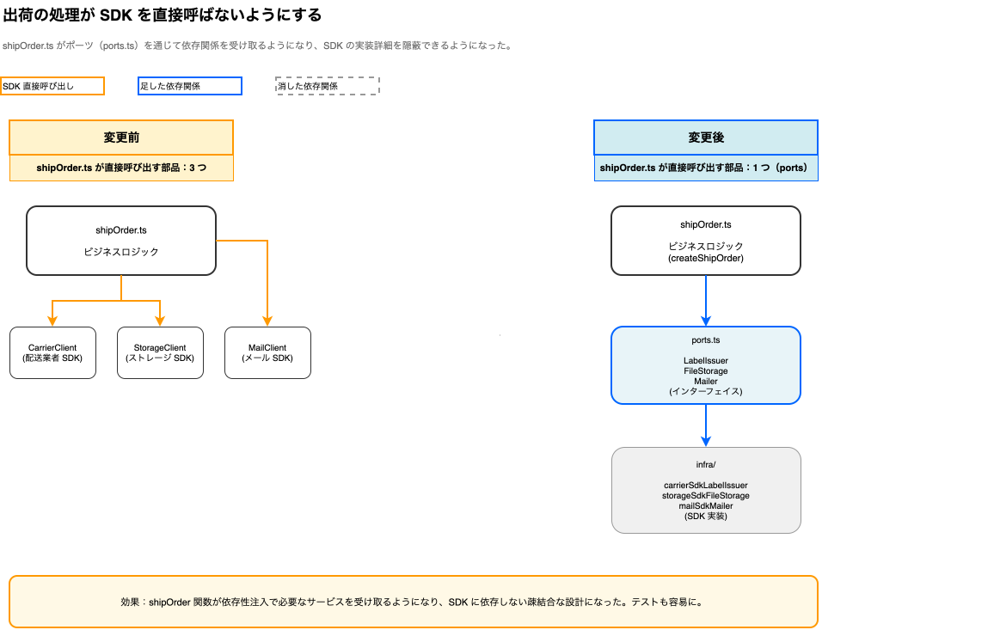

refactor-shipping-ports.png は、依頼した out/ ではなく `repo/out/refactor-shipping-ports.png` に置かれていた。


<details><summary>最後の返答</summary>

~~~~text
完成しました！リファクタリングを説明する図を生成して、`repo/out/refactor-shipping-ports.png` に配置しました。

図の内容：
- **左側（変更前）**：shipOrder.ts が SDK（CarrierClient、StorageClient、MailClient）3つを直接呼び出す結合度の高い設計
- **右側（変更後）**：shipOrder.ts がインターフェイス（ports.ts）に依存し、SDK の実装は infra/ に隠蔽された疎結合な設計

このリファクタリングにより、ビジネスロジックが外部 SDK に依存しなくなり、テストが容易になり、実装の詳細が隠蔽されます。
~~~~

</details>

<a id="refactor-dependency-inversion-fable-51"></a>

### fable-5.1

`claude-fable-5-1`、effort high、2026-09-26T13:01:00 に実行

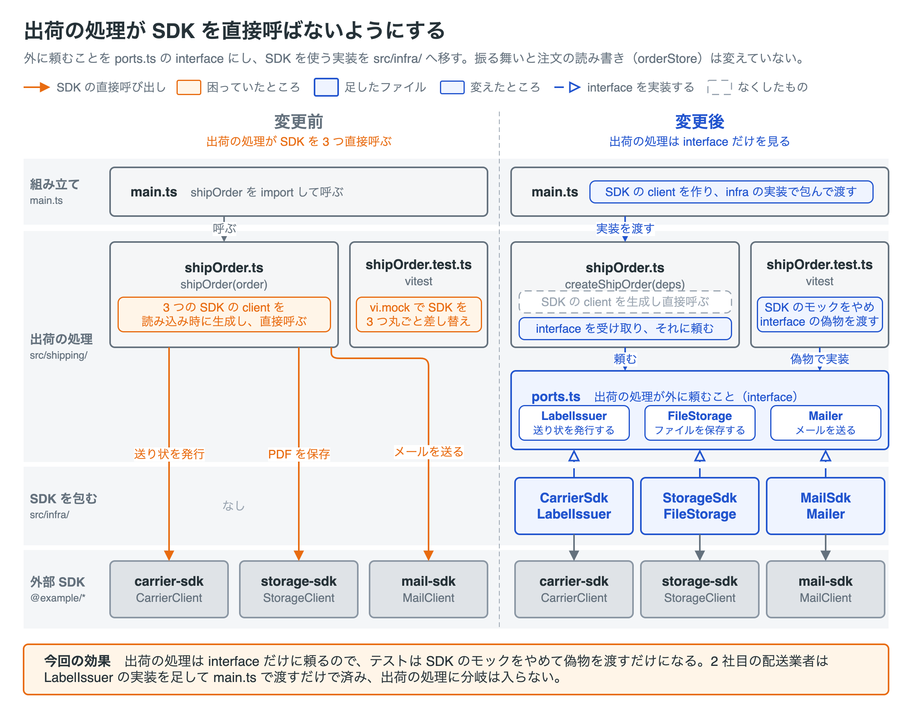


<details><summary>最後の返答</summary>

~~~~text
図を `out/shipping-ports.drawio.png` に置きました。編集元の XML を埋め込んだ PNG なので、draw.io で開けばそのまま直せます。

**図の構成**は、main との差分 1 コミットと notes.md を元にした、層の帯による左右比較です。

- **変更前**は shipOrder.ts が読み込み時に 3 つの SDK client を生成して直接呼び、テストは vi.mock で SDK を丸ごと差し替えていたことを橙で示しています。
- **変更後**は ports.ts の 3 つの interface（LabelIssuer、FileStorage、Mailer）を青で足し、shipOrder.ts はそれだけに頼む形にしました。src/infra/ の 3 クラスが interface を実装し、main.ts が SDK client を包んで渡す流れも入れています。
- **テスト**は SDK のモックをやめて interface の偽物を渡す点を、infra と同じ「実装する」矢印で ports.ts につないでいます。
- **効果の欄**には、テストが偽物を渡すだけになることと、2 社目の配送業者が LabelIssuer の実装追加と main.ts の差し替えで済むことを書きました。orderStore を触っていないことは副題に入れています。

PR に貼るときは、次のように本文と一緒に添付できます。

```bash
gh pr edit -R <owner/repo> <number> --body-file body.md --attach './out/shipping-ports.drawio.png#出荷の処理の変更前後'
```
~~~~

</details>

<a id="refactor-dependency-inversion-gpt-6-astra"></a>

### gpt-6-astra

`gpt-6-astra`、effort high、2026-09-26T13:01:00 に実行

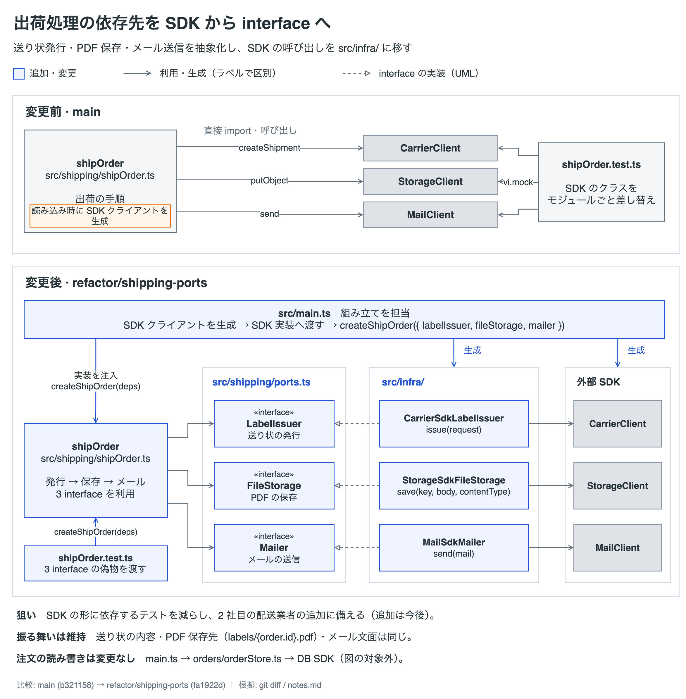


<details><summary>最後の返答</summary>

~~~~text
[out/shipping-refactor.drawio.png](<workspace>/out/shipping-refactor.drawio.png) に作成しました。

main との差分と `notes.md` を基に、依存関係・SDK の生成場所・テストの前後を図解しています。PR に貼れる PNG で、draw.io での再編集も可能です。
~~~~

</details>

<a id="refactor-dependency-inversion-gpt-6-sol"></a>

### gpt-6-sol

`gpt-6-sol`、effort xhigh、2026-09-26T13:01:00 に実行

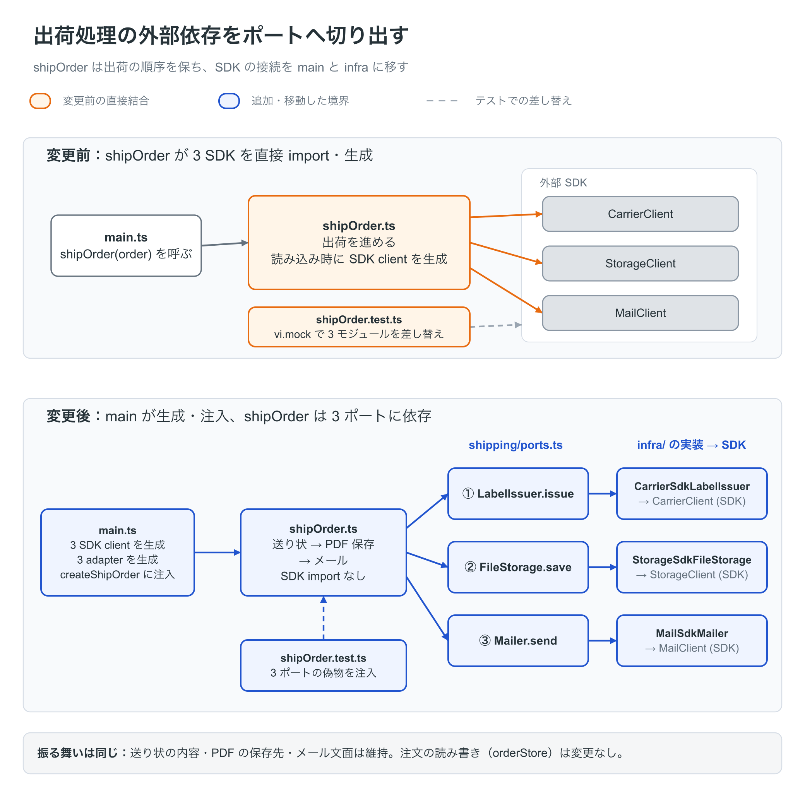


<details><summary>最後の返答</summary>

~~~~text
main との差分と `notes.md` を基に、変更前後の依存関係とテストでの差し替え方を図にしました。送り状・PDF 保存先・メール文面が維持される点も記載しています。

[PR 本文用の図を開く](<<workspace>/out/shipping-ports.drawio.png>)。PNG に編集用の図データを埋め込み、表示とデータの読み取りを確認済みです。
~~~~

</details>

<a id="refactor-dependency-inversion-gpt-6-luna"></a>

### gpt-6-luna

`gpt-6-luna`、effort xhigh、2026-09-26T13:01:00 に実行

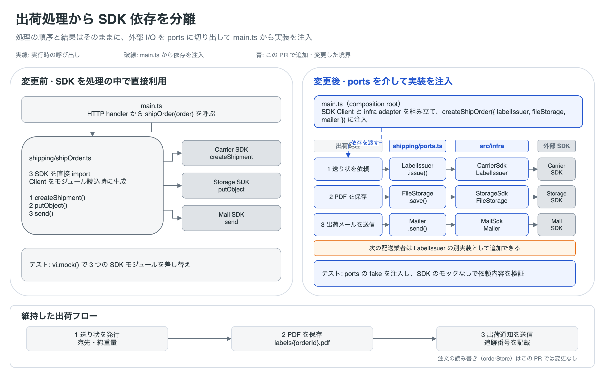


<details><summary>最後の返答</summary>

~~~~text
[out/shipping-refactor.drawio.png](<workspace>/out/shipping-refactor.drawio.png) に図を置きました。変更前後の SDK 依存、ports と adapter、テスト方法、維持した出荷フローをまとめています。PNG には編集元 XML が埋め込まれています。

再書き出しが draw.io で停止したため初回版を残しました。右側パネル上部の注入線ラベルが見出しに重なっています。`repo/` の作業ツリーには変更ありません。
~~~~

</details>

### 実行の条件

依頼文の sha256 `f750a32d945f`、入力の sha256 `1eb48406ec21`。

| モデル | 実行日時 | skill の sha256 | commit | CLI |
|---|---|---|---|---|
| opus-5.5 | 2026-09-26T13:01:00 | `82b734928608` | `ccb5e79`、移す前の dotfiles（非公開） | 2.1.282 (Claude Code) |
| sonnet-5 | 2026-09-26T13:01:00 | `82b734928608` | `ccb5e79`、移す前の dotfiles（非公開） | 2.1.282 (Claude Code) |
| haiku-4.5 | 2026-09-26T13:01:00 | `82b734928608` | `ccb5e79`、移す前の dotfiles（非公開） | 2.1.282 (Claude Code) |
| fable-5.1 | 2026-09-26T13:01:00 | `82b734928608` | `ccb5e79`、移す前の dotfiles（非公開） | 2.1.282 (Claude Code) |
| gpt-6-astra | 2026-09-26T13:01:00 | `82b734928608` | `ccb5e79`、移す前の dotfiles（非公開） | codex-cli 0.156.0 |
| gpt-6-sol | 2026-09-26T13:01:00 | `82b734928608` | `ccb5e79`、移す前の dotfiles（非公開） | codex-cli 0.156.0 |
| gpt-6-luna | 2026-09-26T13:01:00 | `82b734928608` | `ccb5e79`、移す前の dotfiles（非公開） | codex-cli 0.156.0 |

環境の注意書き（どのモデルにも同じ文で渡した）：この環境では、シェルのコマンドは OS のサンドボックスの中で動く。draw.io の書き出し（/Applications/draw.io.app/Contents/MacOS/draw.io -x ...）だけはサンドボックスの外で動くが、ほかのコマンドと &&、;、パイプ、改行でつなげず、単独で実行したときに限る。つなげるとサンドボックスの中で動き、異常終了する。
